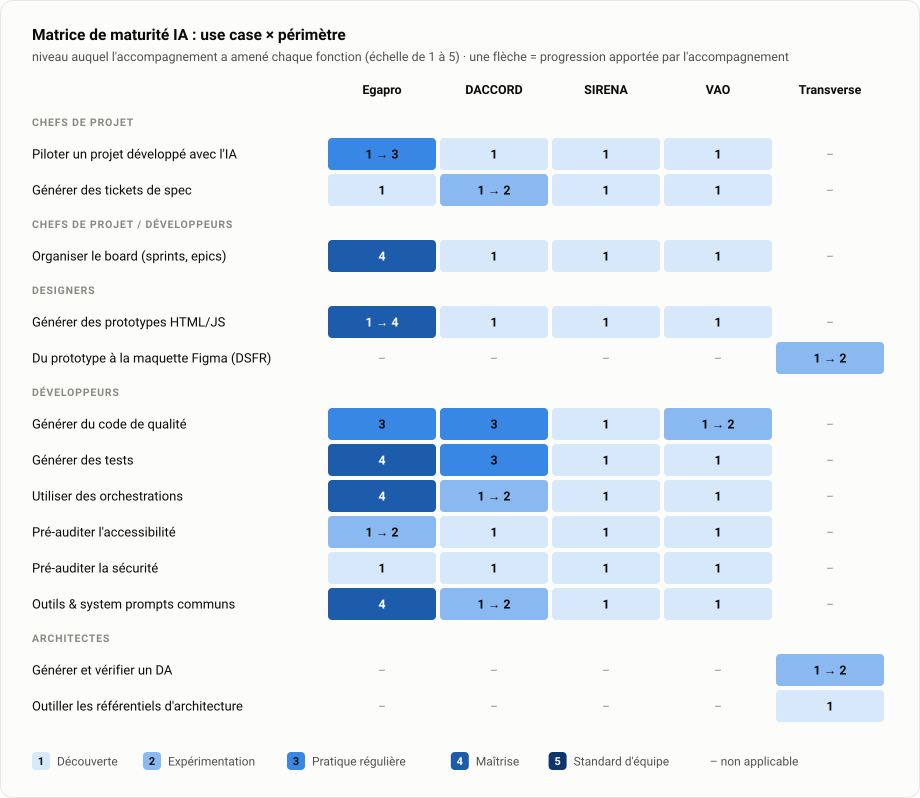

# Details — l'état d'avancement, fiche par fiche

Semaine du 3 au 7 août 2026 · [← retour à la synthèse](README.md)

**Au sommaire** : [plan d'actions](#plan-dactions) · [maturité par périmètre](#maturité-par-périmètre) · [impact des actions](#impact-des-actions) · [matrice de maturité](#matrice-de-maturité) · [zoom coaching](#zoom--coaching-développement-augmenté-daccord-16-juillet) · [focus par chantier](#focus-par-chantier) · [livrables](#livrables-à-date)

## Plan d'actions

Le cœur du suivi : ce qui a été réalisé, ce qui est en cours, ce qui reste à faire. Chaque ligne indique le périmètre, l'action et le métier concerné.

### ✅ Réalisées (12)

- **DACCORD · Former au développement augmenté** *(développeurs)* — session de coaching du 16 juillet, détaillée dans le [zoom](#zoom--coaching-développement-augmenté-daccord-16-juillet).
- **Egapro · Accompagner à la réalisation d'orchestrations** *(développeurs)* — orchestration « séparation codeur / testeur » en place.
- **Egapro · Permettre un meilleur suivi d'un projet utilisant l'IA** *(chefs de projet)* — estimations en taille de T-shirt sur les tickets ; tickets Design créés pour donner à l'équipe de la visibilité sur la roadmap design et la challenger.
- **Egapro · Accompagner à la génération de prototypes** *(designers)* — skill UX adapté au projet, skill d'audit UX, formation à la réalisation de prototypes de maquettes avec Claude.
- **Transverse · Benchmark des harness et modèles de coding agentique** — [bench livré](Livrables/benchHarness/Bench_Coding-Agentique.pdf) : 7 stacks comparées sur prix, performance (SWE-bench), souveraineté et conformité.
- **Transverse · Cadrer la voie Bedrock avec AWS** — [échange du 23 juillet](CR/transverse/AWS-Bedrock-23-07-2026.txt) : un large catalogue de modèles est accessible via Bedrock (dont les open-weight chinois) en conservant l'observabilité ; possibilité d'utiliser des modèles moins chers que ceux d'Anthropic, ce qui compte quand on paie au token. AWS revient avec la liste des modèles disponibles et une documentation d'observabilité.
- **Transverse · Claude Enterprise, discussions avec Software One** — point tenu le 23 juillet, conjointement avec le cadrage de la voie Bedrock (AWS et Software One).
- **Transverse · Cadrer avec Igor l'outillage des référentiels d'architecture** *(architectes)* — [échange du 28 juillet](CR/transverse/Igor-28-07.txt) : le besoin est posé (les référentiels et les DA vivent sur SharePoint, versions difficiles à tracer, structure jamais à jour, ressaisie d'information), la cible est arrêtée (un dépôt de fiches, un dépôt de documents de contexte construits dessus, publication en GitLab Pages, liens vers la source) et la gouvernance aussi (relecteurs, arbitrage final par Igor, ouverture en lecture aux consommateurs dont la TMA). Contrepartie obtenue : l'appui d'Igor sur l'outillage des postes internes.
- **Transverse · Livrer au CEPS l'automatisation de la veille du Journal officiel** — [restitution du 30 juillet](CR/transverse/CEPS_Sabine_Lugand.txt) : Sabine Lugand est satisfaite de l'outil, la newsletter mensuelle sur les spécialités pharmaceutiques est quasi automatisée. La main est passée à Victor Degliame pour la suite (portage hors Python, évolutions demandées).
- **Transverse · Atelier de génération de DA avec l'IA** *(architectes)* — [atelier du 4 août](CR/transverse/CR_Architectes-atelier-4-08-26.txt) : démonstration de la génération d'un DA depuis un code source et présentation de deux voies d'usage de l'IA sur poste ministère (Claude Code via Bedrock, OpenCode Desktop via Albert). 5 use cases identifiés par les architectes ; ils les priorisent par impact et mappent les parties du DA à leurs sources d'ici au 21 août, sélection lors d'un point de synchronisation semaine du 31 août. Le projet expérimental de génération de DA leur est mis à disposition.
- **DACCORD · Atelier d'amélioration des skills** *(développeurs)* — [atelier du 6 août](CR/transverse/daccord-ia-06-08.txt) : l'équipe a avancé sur ses skills, qui couvrent le changement de version (sensible : il impacte un système de vérification), le changelog, le dev front, le dev back (bonnes pratiques, architecture) et le plan d'implémentation. Recommandation de la mission : ajouter des skills de tests back et front, l'équipe visant aussi les tests e2e. Irritant remonté : un forfait trop juste, qui pousse vers OpenCode. Suite immédiate : accompagnement individuel de Sébastien, Florian et Sylvain (voir En cours).
- **Transverse · Point d'adoption IA pour la population produit** — [point du 6 août](CR/products/Adoption-IA-Products-6-08.txt) : la population produit à outiller est hétérogène (coachs, PM/PO, recherche utilisateur), avec des craintes explicites côté RU (être remplacés par l'IA, voir la donnée partir n'importe où). Félix formalise les use cases RU et PM/PO, Olivier liste les équipes prioritaires. L'accompagnement des PM à la génération de tickets intelligibles via MCP est étendu à VAO (Halim) et BIO2 (Yuna, refonte début septembre). Deux avancées connexes : Olivier introduira la mission auprès du centre logiciel, et la centralisation de la documentation fonctionnelle est jugée prioritaire.

### 🔄 En cours (5)

- **DACCORD · Accompagner individuellement l'optimisation des skills et poser les bases de l'orchestration** *(développeurs)* → Sébastien accompagné dès le 6 août, poursuite courant août ; Florian le mardi 11 août ; Sylvain début septembre (congés en août). En parallèle : obtenir l'accès au code via Rémi pour une analyse et des suggestions, et voir avec Gary l'usage des LLM.
- **DACCORD · Adapter les orchestrations Egapro à Jira** *(développeurs)* → poursuivre l'adaptation, puis la mettre entre les mains de l'équipe.
- **Egapro · Piloter le pré-audit d'accessibilité** *(développeurs)* → un [framework de suivi des performances](https://github.com/sboukhari-Ippon/RGAA-Tool-Monitoring) a été proposé à Max et Lucas ; Lucas partage le besoin de mesurer, Max préfère se concentrer sur l'accessibilité d'Egapro. À arbitrer avec Gary : qui porte l'outil de pré-audit hors des sprints Egapro, avec la mesure intégrée.
- **Transverse · Constituer le référentiel d'architecture outillé** (fiches, documents de contexte, skills) *(architectes)* → récupérer le référentiel auprès de Mathias, produire un premier jet de skills, créer et épurer le dépôt, laisser Igor le compléter, figer une version 0.1, puis embarquer la conformité numérique.
- **DACCORD · Accompagner la génération de tickets de spec** *(chefs de projet)* → accompagner Kahina à son retour de congés, en session commune avec Aurélie (SIRENA), mi-août.

### 📅 Planifiées (10)

- **Mi-août — SIRENA · Former Aurélie à l'usage de l'IA pour le PM et le PO**, au-delà de la seule génération de tickets *(chefs de projet)* — en session commune avec Kahina (DACCORD), à son retour de congés.
- **Août — Transverse · Construire avec Louis la solution de prototypes conformes DSFR** (skills anti-hallucination) *(designers)*.
- **Courant août — Transverse · Benchmark élargi aux modèles disponibles sur Bedrock** — dès réception de la liste des modèles par AWS.
- **Courant août — Transverse · Définir et partager un catalogue de skills communs** : besoin PO (besoin métier, US, tests d'acceptance), plan technique orienté ATDD (features passées et futures impactées), dev en ATDD (séparation codeur / testeur), refacto adossé à Sonar.
- **Fin août — Transverse · Demi-journée d'acculturation IA avec Igor et les architectes** — un mardi ou un jeudi.
- **Semaine du 31 août — Transverse · Point de synchronisation pour sélectionner les use cases DA** priorisés par les architectes, et en explorer un s'il est réalisé dans les temps.
- **Début septembre — BIO2 · Accompagner Yuna sur la génération de tickets**, au lancement de la refonte du produit (côté santé) *(chefs de projet)*.
- **Dès l'introduction faite — Transverse · Rencontrer les personnes du centre logiciel** pour y faire packager les harness cibles ; introduction par Olivier, orientation possible via Céline Liechti.
- **8 septembre — VAO · Atelier de formation au développement augmenté** *(développeurs)*.
- **Fin septembre — Transverse · Cartographier les bénéficiaires des comptes Bedrock** (internes, et externes sur sujets sensibles).

### ⏳ À lancer (5)

- **VAO · Accompagner Halim sur la génération de tickets intelligibles via MCP** *(chefs de projet)* → caler un créneau avec Halim, dans la foulée du point produit du 6 août.
- **Transverse · Former les Product Owners à la fenêtre de contexte et au prompt engineering**, présenter un use case → valider l'intérêt d'une séance d'acculturation IA avec Olivier.
- **Transverse · Session d'acculturation de l'ensemble des designers** → éprouver d'abord la solution de prototypes DSFR construite avec Louis ; c'est la condition posée par Norman pour ouvrir la démarche à tous les designers.
- **Transverse · Centraliser la documentation fonctionnelle des produits** (un dossier docs, la doc rangée par epic) → suggérer à Adrien et Gary de porter le sujet en commun avec le studio produit ; sujet jugé prioritaire au point produit du 6 août.
- **Transverse · Évangéliser les équipes du CEPS rencontrées par Victor** → capitaliser sur le MVP livré à Sabine Lugand : trois jours pour quasi automatiser une newsletter mensuelle, avec un besoin clair.

### 🧭 Déclinaisons à cadrer (9)

Actions déjà éprouvées sur un périmètre, à décliner sur les autres une fois le cadrage fait avec chaque équipe. La génération de tickets sur VAO est sortie de cette liste : elle est désormais engagée (Halim, point produit du 6 août).

| Action | À cadrer sur |
|---|---|
| Former au développement augmenté | SIRENA |
| Accompagner à la réalisation d'orchestrations | SIRENA · VAO |
| Piloter le pré-audit d'accessibilité | DACCORD · SIRENA · VAO |
| Accompagner à la génération de prototypes | DACCORD · SIRENA · VAO |

## Maturité par périmètre

Le niveau d'organisation que l'accompagnement a apporté à chaque périmètre, sur une échelle de 1 à 5 :

| Niveau | Signification |
|:---:|---|
| **1 → 2** | De rien à la découverte de l'IA |
| **3** | Des skills utilisés, des use cases IA pratiqués — mais une organisation encore perfectible |
| **4** | Des orchestrations, une organisation maîtrisée |
| **5** | Des orchestrations, un volume de cas d'usage côté dev comme côté PM/PO, une organisation pointue, des bonnes pratiques renseignées, du vrai craft |

| Périmètre | Niveau | Ce que l'accompagnement a changé |
|---|:---:|---|
| Egapro | **3 → 4** | Les orchestrations tournent en routine et l'organisation est maîtrisée — c'était le chaos, ça ne l'est plus |
| DACCORD | **1 → 2** | Coaching, skills partagés couvrant cinq domaines, accompagnement individuel engagé. Le niveau 3 se validera quand les skills seront réellement utilisés au quotidien |
| SIRENA | 2 | Usage IA réel mais individuel, sans coordination d'équipe ; pas encore d'effet de l'accompagnement (formation mi-août) |
| VAO | 1 | Accompagnement à venir (atelier du 8 septembre, tickets avec Halim) |
| BIO2 | 1 | Nouveau périmètre, accompagnement au lancement de la refonte (début septembre) |
| Architectes | **1 → 2** | L'atelier DA a fait passer la fonction de rien à la découverte : cinq use cases identifiés, priorisation en cours |

## Impact des actions

Toutes les actions ne pèsent pas pareil. Chaque action engagée est classée selon ce qu'elle change pour les équipes — et les déterminantes sont décrites une à une, avec ce qu'elles changent concrètement :

| Impact | Ce que ça recouvre |
|---|---|
| ◆◆◆ **Déterminant** | Du concret dans le quotidien des équipes : skills créés ou challengés, orchestrations, accompagnement de mise en place de solutions |
| ◆◆ **Élevé** | Acculturations et formations : elles changent le regard et amorcent la pratique |
| ◆ **Modéré** | Discussions, cadrages, études, communication : elles préparent le terrain |

### Répartition par équipe

| Chantier | ◆◆◆ Déterminant | ◆◆ Élevé | ◆ Modéré |
|---|:---:|:---:|:---:|
| Egapro | 4 | – | – |
| DACCORD | 4 | 1 | – |
| SIRENA | – | 1 | – |
| VAO | 1 | 1 | – |
| BIO2 | 1 | – | – |
| Transverse | 5 | 3 | 11 |
| **Total** | **15** | **6** | **11** |

**Lecture** : sur les périmètres actifs, l'impact est presque exclusivement du concret — Egapro et DACCORD ne comptent qu'une seule action non déterminante (le coaching du 16 juillet, classé formation). Les actions modérées sont toutes transverses : ce sont les chantiers de fond (bench, Bedrock, outillage) qui conditionnent le passage à l'échelle. La formation PM/PO de mi-août étant une session commune SIRENA · DACCORD, elle est comptée sur SIRENA, où elle a été demandée. Le point produit du 6 août fait entrer deux périmètres directement sur des actions déterminantes : VAO (Halim) et BIO2, nouveau périmètre côté santé (Yuna).

### Le classement, action par action

**◆◆◆ Déterminant (15)** — chaque action avec ce qu'elle change concrètement :

| Action | Chantier | Statut | Ce que ça change |
|---|---|---|---|
| Orchestration « codeur / testeur » en routine | Egapro | ✅ Réalisée | Le code arrive testé par une instance indépendante : la qualité ne repose plus sur la seule relecture humaine |
| Pilotage adapté à l'IA (estimations T-shirt, tickets design) | Egapro | ✅ Réalisée | Le suivi projet colle à la vitesse réelle du développement augmenté ; la roadmap design devient visible et challengeable |
| Designers outillés : skills UX, formation prototypes | Egapro | ✅ Réalisée | Raphael génère plusieurs prototypes HTML avant de maquetter : il se projette au lieu d'itérer à l'aveugle |
| Outil de veille du Journal officiel livré au CEPS | Transverse | ✅ Réalisée | Une newsletter mensuelle quasi automatisée en trois jours : la preuve, visible hors DNUM, que l'IA livre vite sur un besoin clair |
| Atelier de génération de DA avec l'IA (4 août) | Transverse | ✅ Réalisée | Les architectes repartent acteurs : cinq use cases identifiés par eux-mêmes, priorisation engagée |
| Atelier d'amélioration des skills (6 août) | DACCORD | ✅ Réalisée | Les skills de l'équipe couvrent cinq domaines et s'améliorent désormais en commun, plus chacun dans son coin |
| Piloter le pré-audit d'accessibilité (framework de monitoring) | Egapro | 🔄 En cours | L'audit du code Egapro passe de 31 à 16 erreurs ; la mesure intégrée évitera un outil piloté au feeling |
| Adapter les orchestrations Egapro à Jira | DACCORD | 🔄 En cours | Le savoir-faire éprouvé sur Egapro se transfère tel quel à une seconde équipe |
| Constituer le référentiel d'architecture outillé (fiches, skills) | Transverse | 🔄 En cours | La règle d'architecture devient exploitable dans l'IDE au moment d'écrire le DA, au lieu d'un PDF SharePoint retrouvé après coup |
| Accompagner la génération de tickets de spec (Kahina) | DACCORD | 🔄 En cours | Des tickets intelligibles du premier coup : moins d'allers-retours entre PM et développeurs |
| Accompagnement individuel skills et bases d'orchestration (Sébastien, Florian, Sylvain) | DACCORD | 🔄 En cours | Du sur-mesure pour transformer les skills en pratique quotidienne et poser les bases de l'orchestration |
| Solution de prototypes conformes DSFR avec Louis (août) | Transverse | 📅 Planifiée | Des prototypes sans hallucination DSFR : la condition posée par Norman pour ouvrir l'IA à tous les designers |
| Catalogue de skills partagés : besoin PO, plan tech ATDD, dev ATDD, refacto Sonar (courant août) | Transverse | 📅 Planifiée | Un socle commun mutualisé entre périmètres, au lieu de reconstruire les mêmes skills équipe par équipe |
| Accompagner Yuna sur la génération de tickets à la refonte (début septembre) | BIO2 | 📅 Planifiée | Les bons réflexes IA posés dès le premier sprint de la refonte |
| Accompagner Halim sur la génération de tickets intelligibles | VAO | ⏳ À lancer | Moins d'allers-retours entre PM et développeurs sur VAO |

**◆◆ Élevé (6)**

| Action | Chantier | Statut |
|---|---|---|
| Coaching développement augmenté du 16 juillet¹ | DACCORD | ✅ Réalisée |
| Formation à l'usage de l'IA pour le PM et le PO (mi-août, session commune avec Kahina) | SIRENA | 📅 Planifiée |
| Demi-journée d'acculturation IA avec Igor et les architectes (fin août) | Transverse | 📅 Planifiée |
| Atelier de formation au développement augmenté (8 septembre) | VAO | 📅 Planifiée |
| Acculturation IA des PO (à valider avec Olivier) | Transverse | ⏳ À lancer |
| Acculturation de l'ensemble des designers | Transverse | ⏳ À lancer |

¹ Classé par nature (formation), mais son effet a déjà dépassé la catégorie : mise en commun des system prompts engagée par l'équipe dès le lundi suivant, use case monté de niveau.

**◆ Modéré (11)**

| Action | Chantier | Statut |
|---|---|---|
| Bench des harness et modèles de coding agentique | Transverse | ✅ Réalisée |
| Cadrage de la voie Bedrock avec AWS (23 juillet) | Transverse | ✅ Réalisée |
| Claude Enterprise : discussions avec Software One (23 juillet) | Transverse | ✅ Réalisée |
| Cadrage des référentiels d'architecture avec Igor (28 juillet)² | Transverse | ✅ Réalisée |
| Point d'adoption IA pour la population produit (6 août) | Transverse | ✅ Réalisée |
| Bench élargi aux modèles Bedrock (août) | Transverse | 📅 Planifiée |
| Point de synchronisation use cases DA (semaine du 31 août) | Transverse | 📅 Planifiée |
| Rencontrer le centre logiciel (introduction par Olivier, orientation Céline Liechti) | Transverse | 📅 Planifiée |
| Cartographie des bénéficiaires des comptes Bedrock (fin septembre) | Transverse | 📅 Planifiée |
| Centraliser la documentation fonctionnelle (avec le studio produit) | Transverse | ⏳ À lancer |
| Évangéliser les équipes du CEPS rencontrées par Victor | Transverse | ⏳ À lancer |

² Le cadrage est une discussion ; la constitution du référentiel outillé qui en découle est, elle, classée déterminante.

Les 9 déclinaisons à cadrer ne sont pas classées : elles hériteront de l'impact de l'action d'origine une fois engagées.

## Matrice de maturité

Le diagnostic fin qui étaye la [maturité par périmètre](#maturité-par-périmètre) : la matrice mesure **le niveau auquel l'accompagnement a amené chaque fonction d'équipe sur chaque use case** (par exemple : les designers d'Egapro sur la génération de prototypes), sur une échelle de 1 à 5 propre aux use cases, distincte de l'échelle d'organisation. Ce n'est pas une note des équipes : le niveau 1 signifie que la fonction démarre tout juste sur ce use case. Un use case non encore observé est noté 1 par convention.

| Niveau | Signification |
|:---:|---|
| **1** | Découverte : la fonction démarre, pas encore de pratique régulière |
| **2** | Expérimentation : pratique ponctuelle, accompagnée, pas encore fiabilisée |
| **3** | Pratique régulière : usage installé dans le quotidien, encore individuel ou dépendant de l'accompagnement |
| **4** | Maîtrise : pratique outillée, reproductible, autonome |
| **5** | Standard d'équipe : pratique mutualisée, mesurée, que l'équipe fait évoluer et diffuse |
| **1 → 3** | Progression apportée depuis le début de l'accompagnement |
| **–** | Non applicable au périmètre |

<picture>
  <source media="(prefers-color-scheme: dark)" srcset="Etat-avancement/assets/05-matrice-dark.svg">
  
</picture>

Version tableau de la matrice

| Métier | Use case | Egapro | DACCORD | SIRENA | VAO | Transverse |
|---|---|:---:|:---:|:---:|:---:|:---:|
| Chefs de projet | Piloter un projet développé avec l'IA | 1 → 3 | 1 | 1 | 1 | – |
| Chefs de projet | Générer des tickets de spec | 1 | 1 | 1 | 1 | – |
| Chefs de projet / Développeurs | Organiser le board (sprints, epics) | 4 | 1 | 1 | 1 | – |
| Designers | Générer des prototypes HTML/JS | 1 → 4 | 1 | 1 | 1 | – |
| Développeurs | Générer du code de qualité | 3 | 3 | 1 | 1 | – |
| Développeurs | Générer des tests | 4 | 3 | 1 | 1 | – |
| Développeurs | Utiliser des orchestrations | 4 | 1 | 1 | 1 | – |
| Développeurs | Pré-auditer l'accessibilité | 1 → 2 | 1 | 1 | 1 | – |
| Développeurs | Pré-auditer la sécurité | 1 | 1 | 1 | 1 | – |
| Développeurs | Outils & system prompts communs | 4 | 1 → 2 | 1 | 1 | – |
| Architectes | Générer un dossier d'architecture (DA) | – | – | – | – | 1 |
| Architectes | Outiller les référentiels d'architecture | – | – | – | – | 1 |

## Zoom : coaching développement augmenté, DACCORD (16 juillet)

Session avec les développeurs de l'équipe, couvrant l'ensemble de la chaîne du développement augmenté ([compte rendu](CR/developpeurs/Feedback_Coaching_Devs_DACCORD.docx)) :

- prompt engineering et enjeu de fenêtre de contexte ;
- system prompts : agents, rules, skills ;
- orchestration de subagents et bonnes pratiques avec l'IA ;
- workflow complet : définir un plan, le faire challenger (y compris par l'IA elle-même), en tirer une checklist autoportante en Markdown, implémenter code ou tests, faire valider chaque élément de la checklist avant de changer de phase ou d'instance, puis build et tests.

**Les retours de l'équipe :**

- « la formation a rendu abordable des sujets qui auraient pu être compliqués » ;
- « la formation a été claire », appréciée pour « le côté interactif de la session » et « le fait de pouvoir poser des questions au fur et à mesure » ;
- « les exemples concrets ont aidé à comprendre les concepts » ;
- « le fait de partir du niveau de l'équipe, et qu'on parvienne quand même à la fin à comprendre les orchestrations, tout en ayant le sentiment que c'est atteignable » ;
- « la formation permet de se projeter sur les compétences à acquérir ».

L'élan s'est concrétisé sans attendre : **dès le lundi 20 juillet, les développeurs ont engagé de leur propre initiative la mise en commun de leurs system prompts (agents, rules, skills)**, de quoi faire monter le use case « outils et system prompts communs » au niveau 2. La mission a relu leurs premiers skills ; l'**atelier d'amélioration des skills s'est tenu le 6 août** et l'accompagnement individuel a démarré dans la foulée (voir le focus DACCORD).

## Focus par chantier

### Egapro : périmètre pilote

- Le périmètre le plus avancé : **5 use cases au niveau maîtrise (4 sur 5)** (orchestrations, tests, board, outillage commun, prototypes designers). Prochain palier commun : le niveau 5, quand ces pratiques seront mutualisées et mesurées par l'équipe elle-même.
- **3 use cases montés de niveau** depuis le début de l'accompagnement : pilotage de projet (1 → 3), prototypes designers (1 → 4), pré-audit d'accessibilité (1 → 2).
- Ce qui a permis ces progressions : estimations T-shirt, tickets design de visibilité, skills UX et formation prototypes, synchronisation des travaux d'accessibilité.
- **Accessibilité : trois chantiers à ne pas confondre** ([compte rendu du 29 juillet](CR/transverse/Avancement%20RGAA_29-07.txt)) — rendre Egapro accessible (résultat acquis : l'audit du code passe de **31 à 16 erreurs**), générer du code accessible (encore adossé au pré-audit, pas de solution autonome), pré-auditer l'accessibilité du code.
- Sur ce dernier point, un [framework de suivi des performances de l'outil dans le temps](https://github.com/sboukhari-Ippon/RGAA-Tool-Monitoring) a été proposé à Max et Lucas. Lucas partage le besoin de mesurer ; Max, saturé entre trouver la solution et l'instrumenter, préfère se concentrer sur l'accessibilité d'Egapro. **Question ouverte pour Gary : qui porte l'outil de pré-audit hors des sprints Egapro et sans reposer sur Max, avec le dispositif de mesure intégré ?** Sans porteur ni mesure, l'outil restera piloté au feeling.
- Prochain palier : le pré-audit de sécurité (encore en découverte).

### DACCORD : l'équipe qui monte

- Coaching développement augmenté du 16 juillet très bien reçu ; l'équipe se projette vers un haut niveau de maîtrise.
- **Passage à l'acte dès le 20 juillet** : mise en commun des system prompts (agents, rules, skills) engagée par les développeurs de leur propre initiative ; **premier use case DACCORD monté de niveau (1 → 2)**. La mission a relu leurs premiers skills.
- **Atelier d'amélioration des skills tenu le 6 août** ([compte rendu](CR/transverse/daccord-ia-06-08.txt)) : l'équipe a avancé sur ses skills, qui couvrent déjà le changement de version (un sujet sensible : il impacte un système de vérification), le changelog, le dev front, le dev back (bonnes pratiques, architecture) et le plan d'implémentation. Recommandation de la mission : **ajouter des skills de tests back et front** ; l'équipe vise aussi les tests e2e. Aucun outil qualité n'est branché à ce jour — Sonar et ESLint arrivent, leur articulation avec les skills et la CI sera à construire.
- **Accompagnement individuel engagé dans la foulée** : Sébastien dès l'après-midi du 6 août (poursuite courant août), Florian le mardi 11 août, Sylvain début septembre (congés en août). Objectif : optimiser les skills et poser les bases de l'orchestration.
- En parallèle : la mission obtient l'accès au code via Rémi pour produire une analyse et des suggestions ; l'usage des LLM est à voir avec Gary. Irritant remonté par l'équipe : **un forfait trop juste, qui la pousse vers OpenCode**.
- Les orchestrations éprouvées sur Egapro sont en cours d'adaptation à Jira, pour un transfert direct de savoir-faire entre périmètres.
- Côté chefs de projet, Kahina sera accompagnée à son retour de congés sur la génération de tickets de spec, **mi-août, en session commune avec Aurélie (SIRENA)**.

### SIRENA : diagnostic complété, demande entrante

- Côté développeurs : usage IA réel mais individuel (contexte `.claude` global sur l'application, production et revue de code assistées chez une partie des développeurs), sans coordination d'équipe — outils et documents de contexte non mutualisés, base de contexte exploitée mais non maintenue.
- **Côté produit, la cheffe de projet a été rencontrée le 30 juillet** ([compte rendu](CR/products/CDP-SIRENA-30-07.txt)). Aurélie a repris le projet en juin après Delphine ; elle partagera les rôles PM et PO avec Valérie (prestataire), les deux tenant les deux rôles. L'équipe compte aussi Axelle (design) et Stéphania (recherche utilisateur).
- Le projet est piloté en mode produit mais ses indicateurs restent projet (coût, délais, qualité). L'usage de l'IA est faible, l'équipe n'a pas de visibilité sur la manière dont ses développeurs s'en servent, et **Aurélie exprime le sentiment de louper le train de l'IA**.
- **Sa demande est explicite : être formée en même temps que Kahina à l'usage de l'IA pour le PM et le PO, mi-août**, avec l'ambition d'aller au-delà de la seule génération de tickets. Engagement de premier ordre : c'est elle qui est demandeuse.
- Pistes identifiées avec elle : automatiser et intégrer des agents, mettre en place un workflow de conception et d'exploration dans Jira, suivre la dette technique, renforcer la communication entre développeurs, et — l'équipe ayant accès aux utilisateurs — **s'appuyer sur l'IA pour formuler les questions auxquelles personne n'aurait pensé** lors des entretiens.
- L'ensemble des use cases est au niveau découverte (les non observés sont notés 1 par convention) : l'image se précisera au cadrage de mi-août.

### VAO : en découverte

- Niveau découverte sur l'ensemble des use cases.
- L'atelier de formation au développement augmenté est fixé au **8 septembre**.
- **Halim sera accompagné sur la génération de tickets intelligibles via MCP** (action issue du point produit du 6 août), avec pour objectif des tickets qui génèrent moins d'allers-retours avec les développeurs ; créneau à caler.

### BIO2 : nouveau périmètre côté santé

- Produit de refonte côté santé, entré dans le suivi via le point produit du 6 août ; la refonte démarre **début septembre**.
- **Yuna sera accompagnée sur la génération de tickets au lancement de la refonte** — l'occasion d'installer les bons réflexes IA dès le premier sprint.

### Architectes : l'atelier DA, puis sortir les référentiels du SharePoint

Le chantier le plus structurant du semestre, ouvert avec Igor le 28 juillet ([intérêt](CR/transverse/Interet_Igor.txt) · [compte rendu](CR/transverse/Igor-28-07.txt)).

- **Atelier de génération de DA tenu le 4 août** ([compte rendu](CR/transverse/CR_Architectes-atelier-4-08-26.txt)). La démonstration (générer un DA depuis un code source, avec les générateurs comparatifs Claude / DeepSeek déjà construits — [réalisations](Livrables/Realisations_par_metier/Architectes/)) a fait émerger **5 use cases à explorer** : cohérence des choix techniques entre eux, cohérence vis-à-vis du fonctionnel, conversion de schémas figés en draw.io éditable, conformité des schémas au modèle de DA, écarts entre DA et code réel. Appris au passage : un modèle de DA propre aux applications Atlas existe ; deux irritants remontés (ergonomie du DA pénible à remplir, incohérences techniques difficiles à percevoir). Les architectes priorisent les use cases par impact et mappent les parties du DA à leurs sources **d'ici au 21 août** ; sélection lors d'un point de synchronisation **semaine du 31 août**. Le projet expérimental de génération de DA est mis à leur disposition.
- **Le problème posé par les référentiels** : le cadre de cohérence et les DA vivent sur SharePoint — versions difficiles à tracer, structure des documents jamais à jour, ressaisie d'information, partage mal maîtrisé. Le référentiel existe mais ne circule pas.
- **La cible : traiter le référentiel comme du code.** Un dépôt de fiches faisant source de vérité, un dépôt de documents de contexte construits dessus, publiés en GitLab Pages, chaque élément renvoyant vers sa source ; puis une **bibliothèque de skills standards validés par les responsables du référentiel**, pour que la règle d'architecture soit exploitable dans l'IDE au moment où l'on écrit le DA, au lieu d'un PDF retrouvé après coup.
- **Gouvernance posée par Igor** : relecteurs, arbitrage final par lui, ouverture en lecture à tous les consommateurs du référentiel, TMA comprise. Il est ouvert sur les documents de contexte à créer et nous invite à y mettre ce qui compte dans notre quotidien.
- **Séquence** : récupérer le référentiel auprès de Mathias → premier jet de skills → créer et épurer le dépôt → laisser Igor le compléter → figer une version 0.1 → embarquer la conformité numérique. Le studio d'architecture, qui détient déjà le cadre de cohérence, peut être sollicité en cas de manque. Créneau de rapprochement : le jeudi de 14 h à 15 h, où Igor réunit les architectes. Une **demi-journée d'acculturation IA est à poser fin août** (un mardi ou un jeudi).
- ⏱️ **Contrainte de calendrier** : les développeurs d'Igor partent en septembre et en octobre — la fenêtre de montée en compétence est étroite.

### Design : le prototype avant la maquette

- **Egapro** : grâce aux skills fournis, Raphael **génère plusieurs prototypes HTML avant de maquetter** — il se projette au lieu d'itérer à l'aveugle ([compte rendu](CR/design/Avancement-Design.txt)).
- **Août, avec Louis** : industrialiser un framework de skills générant des prototypes **conformes au DSFR** (anti-hallucination), Louis sur les règles d'UX, Selim sur la performance des skills.
- **Ensuite** : session d'acculturation de l'ensemble des designers — Norman la conditionne à une solution éprouvée.

### Population produit : PM/PO, POs, recherche utilisateur

- **Point d'adoption IA tenu le 6 août** ([compte rendu](CR/products/Adoption-IA-Products-6-08.txt)). La population à outiller est hétérogène — coachs, PM/PO, recherche utilisateur — et les craintes des RU sont explicites (être remplacés par l'IA, voir la donnée partir n'importe où) : la réponse passera par des use cases dédiés, que **Félix formalise** (RU et PM/PO) ; **Olivier liste les équipes prioritaires** à accompagner.
- L'accompagnement des PM sur la **génération de tickets intelligibles via MCP** (moins d'allers-retours avec les développeurs) couvre SIRENA, DACCORD, VAO (Halim) et BIO2 (Yuna, refonte début septembre).
- À suivre également : la **centralisation de la documentation fonctionnelle** (un dossier docs, la doc rangée par epic), jugée prioritaire — à proposer à Adrien et Gary pour un portage commun avec le studio produit ; l'embarquement de l'équipe de Pierre-Étienne, notamment la synchronisation sur la charte d'usage de l'IA ; la piste OpenWork suggérée par Félix.
- POs : acculturation IA à valider avec Olivier.

### Fondations : postes internes, Bedrock, harness, skills communs

- **Outillage des postes internes — le point dur de la mission trouve une piste.** Un agent interne sur poste managé ne peut pas installer un harness. Deux voies, ouvertes par Igor : le packaging par le **centre logiciel** (rencontrer **Céline Liechti**, qui saura nous orienter vers les bonnes personnes) ou la **demande de compte administrateur temporaire** contresignée par le manager. **Avancée du 6 août** : le centre logiciel peut tolérer des outils restreints à une liste de personnes, et **Olivier introduira la mission auprès des personnes qui le gèrent** — un chemin plus court que le packaging généralisé. C'est le sujet à instruire pour que la stratégie d'adoption dépasse le cercle des prestataires.
- Côté développeurs, la sécurité s'oriente vers des postes à système libre avec une VM dédiée à la bureautique, la bureautique n'ayant pas vocation à tourner sur un environnement aussi ouvert. Point à vérifier : `npx` semble bloqué, HTTP passe.
- **Bedrock cadré avec AWS (23 juillet)** : large catalogue de modèles accessible (dont open-weight chinois) en conservant l'observabilité, donc possibilité de modèles moins chers que ceux d'Anthropic (un levier réel quand on paie au token). En attente : liste des modèles disponibles et documentation d'observabilité. Cartographie des bénéficiaires des comptes Bedrock (internes, et externes sur sujets sensibles) prévue fin septembre. Vigilance coûts : les externes peuvent conserver leur abonnement Claude, les internes démarreront à environ 20 € par siège plus la consommation au token (prix du modèle).
- Outillage : Claude Enterprise discuté avec Software One lors du point du 23 juillet, conjointement au cadrage AWS Bedrock.
- Harness : [bench de coding agentique livré](Livrables/benchHarness/Bench_Coding-Agentique.pdf) ; élargissement aux modèles Bedrock courant août (dès la liste AWS), puis bench en conditions réelles (scénarios Albert et Claude).
- **Catalogue de skills partagés à définir courant août**, pour mutualiser entre périmètres ce qui a été éprouvé : skill besoin PO (besoin métier, US, tests d'acceptance), skill plan technique orienté ATDD (intégrant les features passées et futures impactées), skill dev en ATDD (séparation codeur / testeur, éprouvée sur Egapro), skill refacto adossé à Sonar.
- Stratégie en trois horizons présentée et validée ([support](Livrables/Pr%C3%A9sentation-strat%C3%A9gie-transfo-ia/Point-etape_Adoption-IA.pdf)).

### Visibiliser l'accompagnement hors DNUM : le CEPS

Troisième enjeu de la mission : faire connaître le savoir-faire IA du studio Tech de la DNUM au-delà des équipes suivies. Premier terrain, le **CEPS** (Comité économique des produits de santé) :

- **Livré** : veille du Journal officiel sur les spécialités pharmaceutiques **automatisée et restituée en newsletter** — un MVP en 3 jours, **Sabine Lugand satisfaite** ([cadrage](CR/transverse/R%C3%A9alisations-secondaires.txt) · [restitution](CR/transverse/CEPS_Sabine_Lugand.txt)).
- **Passation à Victor Degliame** : rendre la solution utilisable par des personnes qui ne peuvent pas installer Python, intégrer les évolutions demandées.
- **Message à porter aux équipes du CEPS** : l'IA permet de produire vite dès que le besoin est clair — le besoin, exprimé « avec de l'IA », a d'ailleurs été atteint sans en avoir besoin. L'IA là où elle apporte, pas par réflexe.

## Livrables à date

| Livrable | Pour qui | Où |
|---|---|---|
| Stratégie de transformation IA (point d'étape) | Direction | [PDF](Livrables/Pr%C3%A9sentation-strat%C3%A9gie-transfo-ia/Point-etape_Adoption-IA.pdf) |
| Récit de mission : l'impact de l'adoption IA, en 1 slide et en 3 slides | Direction | [Recit-Mission2](Livrables/Recit-Mission2/) |
| Bench des harness de coding agentique | Direction, tech leads | [PDF](Livrables/benchHarness/Bench_Coding-Agentique.pdf) |
| Démarche de pré-audit RGAA et suivi des itérations (méthodo, erreurs de référence, journal) | Développeurs, accessibilité | [RGAA-Demarche](Livrables/RGAA-Demarche/) |
| Kit de configuration dev augmenté (analyse → implémentation → portage Jira) | Développeurs | [tuto-config_Orchestration](Livrables/Realisations_par_metier/Developpeurs/tuto-config_Orchestration/) |
| Skills de pré-audit RGAA et cyber | Développeurs | [RGAA_et_Cyber](Livrables/Realisations_par_metier/Developpeurs/RGAA_et_Cyber/) |
| Skill UX projet, skill d'audit UX, use case maquette | Designers | [Designers](Livrables/Realisations_par_metier/Designers/) |
| Générateurs de dossiers d'architecture (Claude / DeepSeek) | Architectes | [Architectes](Livrables/Realisations_par_metier/Architectes/) |

---

Sources : <code>Etat-avancement.xlsx</code> et <a href="https://grist.numerique.gouv.fr/o/tranfo-ia/rFkVL6aLFbrE/Etat-davancement">Grist</a> · graphiques générés par <code>Etat-avancement/build/generate_charts.py</code> (éditer la section DONNÉES puis relancer) · Selim Boukhari, Ippon Technologies
