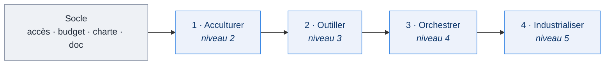

# Déployer l'IA sur le cycle produit · la checklist par équipe

Quatre paliers, un par niveau de maturité de [l'état d'avancement](../../README.md#maturité-par-chantier). Une équipe franchit un palier quand chaque case applicable est cochée **et tenue à l'usage**, pas à la sortie de l'atelier.

La cible que ces paliers rapprochent, skill par skill : [le cycle produit augmenté par l'IA](Cycle-produit-IA.md).

## Où en est chaque équipe

Position lue depuis l'état d'avancement du 15 septembre 2026, à valider équipe par équipe. ✅ atteint · 🔄 en cours · ☐ à venir

| Équipe | Socle | 1 · Acculturer | 2 · Outiller | 3 · Orchestrer | 4 · Industrialiser | Niveau |
|---|:---:|:---:|:---:|:---:|:---:|:---:|
| **Egapro** | 🔄 doc fonctionnelle | ✅ | ✅ | ✅ | 🔄 pré-audit RGAA, mesure | **4** |
| **DACCORD** | 🔄 budget tokens | ✅ devs et PM/PO formés | 🔄 skill ticket en prise en main, skills dev en atelier, Sonar et ESLint arrivent | 🔄 orchestration front et back en place, à étendre | ☐ | **2** |
| **SIRENA** | 🔄 | 🔄 formation PM/PO à caler | ☐ | ☐ | ☐ | **2** |
| **VAO** | 🔄 OpenCode installé | 🔄 devs formés le 3/09, tickets avec Halim à caler | ☐ | ☐ | ☐ | **2** |

Les architectes et les designers suivent une piste transverse, hors grille : première orchestration de DA en prise en main chez les architectes ; solution prototype → maquette Figma DSFR validée chez les designers, boucle de feedback en construction.

## Le socle, avant tout palier

Porté par la mission et le transverse, pas par l'équipe. Sans lui, rien ne tient.

- [ ] Un harness légal sur poste ministère : OpenCode Desktop + Albert, ou Claude Code + Bedrock
- [ ] Un budget tokens dimensionné (un forfait trop juste renvoie vers des solutions non conformes)
- [ ] La charte d'usage IA connue de l'équipe
- [ ] La documentation fonctionnelle centralisée (un dossier docs, rangé par epic)
- [ ] Un ou une référente IA dans l'équipe

## La grille : ce que l'équipe sait faire, métier par métier

Colonnes = les quatre étapes de [l'usine logicielle cible](../../README.md#la-cible--lusine-logicielle). Une case ne concerne pas l'équipe (pas de designer, par exemple) : NA, elle ne bloque pas.

| Palier | Product (PM / PO) | Design | Build (dev) | Livraison (CI, run) |
|---|---|---|---|---|
| **1 · Acculturer** *chacun a vu l'IA sur son propre quotidien* | ☐ Atelier tickets suivi ☐ Un ticket réel généré via MCP | ☐ Démo prototype DSFR vue ☐ Un prototype généré sur un écran réel | ☐ Atelier dev augmenté suivi : contexte, system prompts, workflow plan → checklist → implem → validation | ☐ État des lieux de la CI fait : lint, tests, couverture |
| **2 · Outiller** *les outils sont partagés, versionnés, utilisés* | ☐ Skill ticket en usage : besoin métier, US, tests d'acceptance ☐ Le ticket IA est la norme | ☐ Skills UX projet et audit DSFR / RGAA en usage ☐ Prototypes HTML avant chaque maquette | ☐ Contexte partagé versionné dans le repo (CLAUDE.md / AGENTS.md, rules) ☐ Skills front, back, tests dans le repo, revus en atelier skills | ☐ Rail déterministe en CI : formatage, tests, couverture Sonar ☐ Skill changelog en usage |
| **3 · Orchestrer** *le workflow est structuré, l'organisation maîtrisée* | ☐ Pilotage adapté à l'IA : estimations T-shirt, tickets design visibles ☐ Definition of Ready outillée | ☐ Prototype → maquette Figma en composants DSFR ☐ Boucle de feedback prototype ↔ maquette | ☐ Orchestration codeur / testeur (ATDD) en routine, branchée sur le board ☐ Plan technique orienté ATDD : features passées et futures impactées | ☐ Pré-audits RGAA et sécurité dans le flux ☐ Review humaine systématique du code généré |
| **4 · Industrialiser** *l'usine tourne et se mesure* | ☐ Use cases PM / PO en volume : spec, recette assistée, doc | ☐ Skills design versés au catalogue commun, diffusés aux autres équipes | ☐ Bot de revue IA sur la CI : l'agent propose, la règle prouve, l'humain valide ☐ Refacto adossé à Sonar | ☐ Notes de version, changelog, doc automatisés ☐ Tableau de bord DORA lu avant / après ☐ Bonnes pratiques renseignées, skills que l'équipe fait évoluer |

**Trois règles.** On ne saute pas de palier. La règle avant l'agent : le rail déterministe (palier 2) précède le bot de revue (palier 4). Le palier atteint est le niveau publié dans l'état d'avancement.

Les architectes suivent une piste transverse : leur référentiel outillé et leurs skills standards alimentent le palier 2 de toutes les équipes. Les designers aussi : la solution prototype → Figma DSFR, une fois sa boucle de feedback en place, sert la colonne Design de chaque équipe.

## Ce qu'il faut pour franchir chaque palier

| Palier | L'équipe apporte | La mission apporte | Preuve |
|---|---|---|---|
| **1** | Une demi-journée par métier | Ateliers, démos sur un cas réel de l'équipe | Un artefact produit par métier |
| **2** | Ses skills, revus ensemble | Catalogue de skills communs, relecture, atelier skills | Skills et contexte dans le repo, CI verte |
| **3** | Son workflow, adapté à son board | Orchestrations éprouvées (Egapro), accompagnement individuel | Tickets livrés par l'orchestration |
| **4** | Ses indicateurs avant / après | Bot de revue, tableau de bord DORA, mesure | Un trimestre de données |
