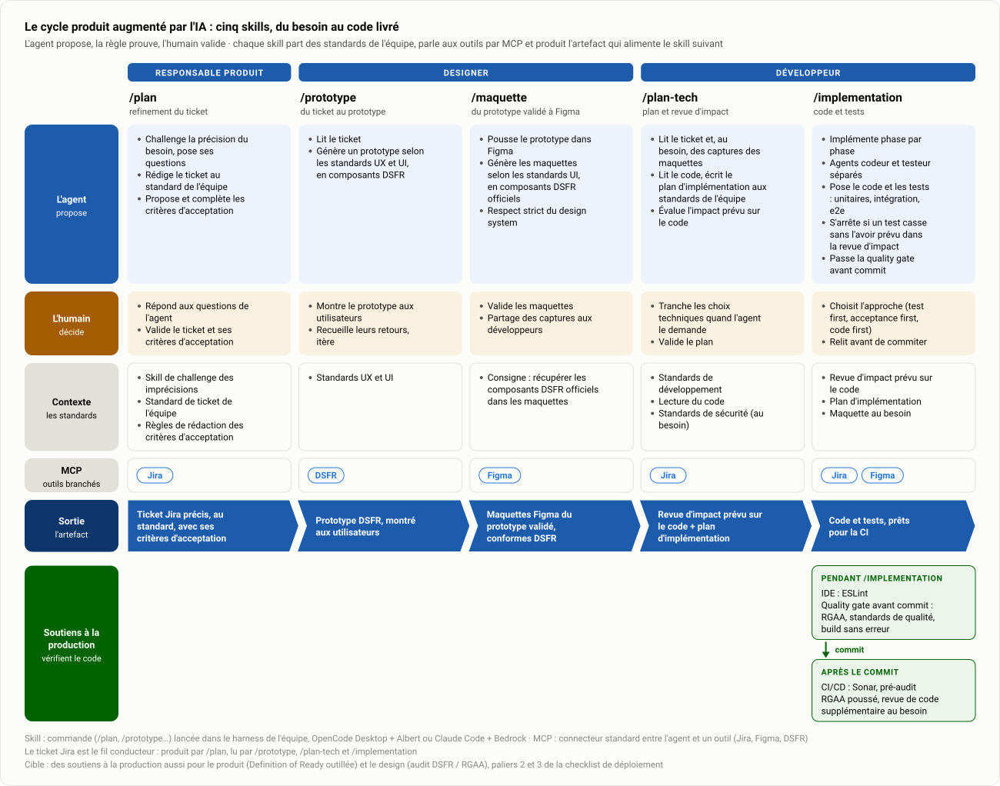

# Le cycle produit augmenté par l'IA

Cinq skills, du besoin au code livré. Chacun part des **standards de l'équipe** (le contexte), parle aux outils par **MCP** et produit **l'artefact** qui alimente le suivant. À chaque étape, l'agent propose, la règle prouve, l'humain valide.

<picture>
  <source media="(prefers-color-scheme: dark)" srcset="assets/cycle-produit-ia-dark.svg">
  
</picture>

Le même schéma vit dans l'onglet **Cible** du [tableau de bord](../../Suivi-Strategie-Adoption-IA.html). Les [paliers de la checklist](Checklist-IA-par-equipe.md) disent comment une équipe s'en rapproche.

## Skill par skill

Un skill est une commande (`/plan`, `/prototype`…) lancée dans le harness de l'équipe : OpenCode Desktop + Albert, ou Claude Code + Bedrock. Un MCP est le connecteur standard entre l'agent et un outil (Jira, Figma, DSFR, Playwright).

### Responsable produit · `/plan`, le refinement du ticket

- **L'agent** challenge le niveau de précision du besoin et pose ses questions à l'humain ; rédige le ticket selon le standard décidé par l'équipe ; propose et complète les critères d'acceptation.
- **L'humain** répond aux questions, valide le ticket et ses critères d'acceptation.
- **Contexte** : skill de challenge des imprécisions, standard de ticket de l'équipe, règles de rédaction des critères d'acceptation.
- **MCP** : Jira.
- **Sortie** : un ticket Jira précis, au standard, avec ses critères d'acceptation.

### Designer · `/prototype`, du ticket au prototype

- **L'agent** lit le ticket et génère un prototype selon les standards UX et UI, en composants DSFR.
- **L'humain** montre le prototype aux utilisateurs, recueille leurs retours, itère.
- **Contexte** : standards UX et UI.
- **MCP** : DSFR.
- **Sortie** : un prototype DSFR, montré aux utilisateurs.

### Designer · `/maquette`, du prototype validé à Figma

- **L'agent** pousse le prototype dans Figma et génère les maquettes selon les standards UI, en composants DSFR officiels ; respect strict du design system.
- **L'humain** valide les maquettes.
- **Contexte** : la consigne de récupération des composants DSFR officiels dans les maquettes.
- **MCP** : Figma.
- **Sortie** : des maquettes Figma qui exposent le prototype validé, conformes DSFR.

### Développeur · `/plan-tech`, plan et revue d'impact

- **L'agent** lit le ticket et, au besoin, les maquettes dans Figma ; lit le code ; écrit le plan d'implémentation aux standards de l'équipe ; évalue l'impact prévu du ticket sur le code.
- **L'humain** tranche les choix techniques quand l'agent le demande, valide le plan.
- **Contexte** : standards de développement, lecture du code, standards de sécurité au besoin.
- **MCP** : Jira, Figma, DSFR.
- **Sortie** : le document d'impact prévu sur le code et le plan d'implémentation.

### Développeur · `/implementation`, code et tests

- **L'agent** reprend la revue d'impact et le plan, la maquette si nécessaire ; implémente phase par phase ; sépare les agents codeur et testeur ; pose le code et les tests unitaires, d'intégration, e2e ; s'arrête si un test casse sans l'avoir prévu dans la revue d'impact ; passe la quality gate avant commit : RGAA, standards de qualité, build sans erreur.
- **L'humain** choisit l'approche (test first, test d'acceptance first ou code first), relit avant de commiter.
- **Contexte** : le document d'impact prévu sur le code, le plan d'implémentation.
- **MCP** : Jira, Figma, DSFR, Playwright.
- **Sortie** : le code et les tests.

## Les soutiens à la production

Ils ne concernent que le code, donc le skill `/implementation` et ce qui suit le commit. Ni le produit ni le design ne passent par là.

| Quand | Quoi |
|---|---|
| **Pendant `/implementation`**, dans l'IDE | ESLint |
| **Pendant `/implementation`**, avant le commit | Quality gate : RGAA, standards de qualité, build sans erreur |
| **À chaque push**, en CI/CD, **en boucle avec la phase** | Revue de code par un bot IA, puis Sonar. Revue rejetée ou issue Sonar : la correction rejoint le plan de la phase et repart au codeur. L'humain arbitre les remarques du bot et merge |
| **Chaque nuit**, en CI/CD, **hors boucle** | Pré-audit RGAA poussé, analyse de sécurité, sur la branche principale : trop long pour tourner à chaque push. Chaque écart ouvre un ticket, corrigé dans un prochain ticket, pas dans la phase en cours |

Deux temps, donc deux régimes : ce qui peut trancher en quelques minutes boucle avec `/implementation` ; ce qui prend la nuit produit des tickets. Le bot de revue IA est une cible, palier 4 de la [checklist](Checklist-IA-par-equipe.md) : aucune équipe ne l'a encore en place.

Cible : des soutiens du même ordre pour le produit (Definition of Ready outillée) et le design (audit DSFR / RGAA), paliers 2 et 3 de la [checklist](Checklist-IA-par-equipe.md).

## Trois lectures

1. **Le ticket est le fil conducteur** : produit par `/plan`, lu par `/prototype`, `/plan-tech` et `/implementation`. Sa qualité conditionne tout le reste.
2. **Les standards sont le contexte** : un skill ne vaut que par les standards de l'équipe qu'il embarque (ticket, UX/UI, développement, sécurité). Les écrire et les versionner, c'est le palier 2.
3. **L'humain reste à chaque étape** : il répond, montre, valide, tranche, relit. L'agent propose, la règle prouve, l'humain valide.

Source du schéma : `build/generate_cycle.py` (SVG clair et sombre, fragment HTML du tableau de bord). Modifier le contenu dans le script, relancer, relire le rendu.
