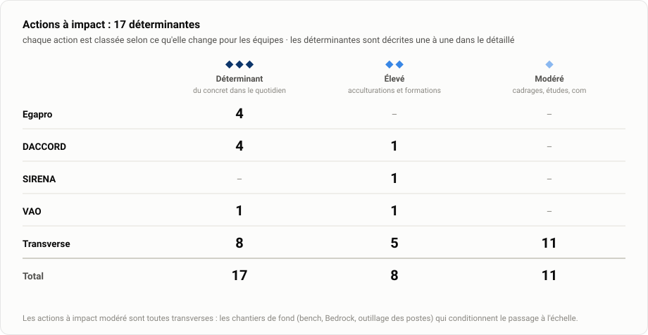

# Transformation IA · Ministères sociaux

**Accompagner l'adoption de l'IA par les équipes du numérique** (Secrétariat général · Direction du numérique) : trois enjeux (identifier les usages, accompagner la maîtrise, évangéliser), quatre métiers (architectes, chefs de projet, designers, développeurs).

**Édition du jeudi 30 juillet 2026** · mise à jour hebdomadaire · [version détaillée](Etat-avancement/Etat-avancement-detaille.md) · [la stratégie (PDF)](Livrables/Pr%C3%A9sentation-strat%C3%A9gie-transfo-ia/Point-etape_Adoption-IA.pdf)

---

## 🔦 Temps fort du mois

> [!IMPORTANT]
> **Développement augmenté : l'équipe DACCORD passe à l'acte.**
> - Formés le 16 juillet, les développeurs ont engagé **dès le lundi suivant, de leur propre initiative, la mise en commun de leurs system prompts** (agents, rules, skills) : la première brique d'une pratique d'équipe structurée.
> - Les retours de la formation annonçaient ce déclic ([compte rendu](CR/developpeurs/Feedback_Coaching_Devs_DACCORD.docx)) : « claire », « des exemples concrets », « le sentiment que c'est atteignable ».
> - La suite : relecture des premiers skills par Selim, atelier d'amélioration le 6 août, puis accompagnements ponctuels pour ancrer la pratique.

## L'essentiel

<picture>
  <source media="(prefers-color-scheme: dark)" srcset="Etat-avancement/assets/01-kpi-dark.svg">
  
</picture>

- **L'impact se mesure en niveaux gagnés : 4 use cases ont monté de niveau** (pilotage, prototypes et pré-audit d'accessibilité sur Egapro ; system prompts communs sur DACCORD).
- **Stratégie en trois horizons validée**, premier horizon (« outiller chaque métier ») en exécution : chaque métier dispose d'au moins un use case outillé et éprouvé sur le terrain.
- **L'accompagnement s'auto-alimente** : les dernières demandes sont entrantes — la cheffe de projet SIRENA demande à être formée, l'architecte du cadre de cohérence propose d'outiller ses référentiels.

## ⚖️ Décisions attendues

1. **Pré-audit d'accessibilité** : désigner un porteur de l'outil hors des sprints Egapro, avec la mesure intégrée — arbitrage attendu de Gary.
2. **Postes internes** : ouvrir l'accès au centre logiciel pour y packager les harness — rencontre de Céline Liechti à faciliter. Sans cela, l'adoption reste cantonnée aux prestataires.
3. **Stack des agents internes** : choix au meilleur rapport performance / prix / souveraineté / conformité, à instruire après le bench élargi aux modèles Bedrock (août).

## Avancement par chantier

<picture>
  <source media="(prefers-color-scheme: dark)" srcset="Etat-avancement/assets/02-maturite-dark.svg">
  
</picture>

→ [La matrice complète, use case par use case](Etat-avancement/Etat-avancement-detaille.md#matrice-de-maturité)

**L'effort est mis là où il transforme** : ◆◆◆ déterminant = du concret (skills, orchestrations, solutions) · ◆◆ élevé = acculturations et formations · ◆ modéré = cadrages, études, communication.

<picture>
  <source media="(prefers-color-scheme: dark)" srcset="Etat-avancement/assets/07-impact-dark.svg">
  
</picture>

→ [Le classement, action par action](Etat-avancement/Etat-avancement-detaille.md#impact-des-actions)

| Chantier | Statut | Où on en est | Prochaine étape |
|---|:---:|---|---|
| **Egapro** | 🟢 ↗ | Périmètre pilote : orchestrations maîtrisées, designers autonomes sur les prototypes, 3 use cases montés de niveau. Accessibilité : l'audit du code passe de 31 à 16 erreurs | Arbitrer avec Gary le portage de l'outil de pré-audit hors des sprints Egapro |
| **DACCORD** | 🟢 ↗ | Équipe passée à l'acte : mise en commun des system prompts engagée en autonomie dès le 20/07 (use case monté 1 → 2), orchestrations Egapro en cours d'adaptation à Jira | Atelier d'amélioration des skills le 6 août |
| **SIRENA** | 🟢 ↗ | Diagnostic complété côté produit : Aurélie a repris le projet en juin et demande explicitement à être formée à l'usage de l'IA pour le PM / PO | Session commune avec Kahina (DACCORD) mi-août |
| **VAO** | 🟡 → | Équipe en découverte, besoins identifiés | Atelier dev augmenté le 8 septembre |
| **Transverse** | 🟢 ↗ | Stratégie 3 horizons validée, bench des harness livré, cadrage Bedrock avec AWS (23/07), accord de principe avec Igor sur l'outillage des référentiels d'architecture (28/07) | Ateliers DA architectes et Claude Enterprise le 3 août |

🟢 sur la trajectoire · 🟡 cadrage en cours · 🔴 point d'attention. SRDT et DomiFA, rencontrées en exploration, rejoindront le suivi actif au fil de l'eau.

## Plan d'actions

<picture>
  <source media="(prefers-color-scheme: dark)" srcset="Etat-avancement/assets/03-actions-dark.svg">
  
</picture>

- **✅ Réalisé** : coaching dev augmenté DACCORD (16/07) · orchestration « codeur / testeur » Egapro · pilotage adapté à l'IA Egapro · designers Egapro outillés · bench harness + modèles livré · cadrage Bedrock avec AWS (23/07) · cadrage des référentiels d'architecture avec Igor (28/07) · outil de veille du JO livré au CEPS (30/07)
- **🔄 En cours** : orchestrations Egapro → Jira (DACCORD) · pré-audit d'accessibilité Egapro · tickets de spec DACCORD · constitution du référentiel d'architecture outillé
- **📅 Planifié** : ateliers DA et Claude Enterprise (3/08) · atelier skills DACCORD (6/08) · formation PM / PO SIRENA-DACCORD (mi-août) · prototypes DSFR avec Louis (août) · bench élargi Bedrock (août) · acculturation IA des architectes (fin août) · rencontre Céline Liechti (centre logiciel) · atelier dev augmenté VAO (8/09) · cartographie des comptes Bedrock (fin sept.)
- **⏭️ À lancer** : acculturation IA des PO · acculturation de l'ensemble des designers · retour d'expérience du MVP CEPS

→ [Le plan d'actions commenté, action par action](Etat-avancement/Etat-avancement-detaille.md#plan-dactions)

## Roadmap

<picture>
  <source media="(prefers-color-scheme: dark)" srcset="Etat-avancement/assets/04-roadmap-dark.svg">
  
</picture>

## Architecture : sortir les référentiels du SharePoint

Le chantier le plus structurant du semestre, ouvert avec Igor le 28 juillet ([intérêt](CR/transverse/Interet_Igor.txt) · [compte rendu](CR/transverse/Igor-28-07.txt)).

- **Le problème** : le cadre de cohérence et les DA vivent sur SharePoint — versions difficiles à tracer, structure jamais à jour, information ressaisie. Le référentiel existe mais ne circule pas.
- **La cible : traiter le référentiel comme du code.** Un dépôt de fiches (source de vérité), des documents de contexte construits dessus, publiés en GitLab Pages, puis une **bibliothèque de skills standards validés** : la règle d'architecture devient exploitable dans l'IDE au moment d'écrire le DA, au lieu d'un PDF retrouvé après coup.
- **Gouvernance posée par Igor** : relecteurs, arbitrage final par lui, lecture ouverte à tous les consommateurs du référentiel, TMA comprise.
- **Séquence** : récupérer le référentiel (Mathias) → premier jet de skills → dépôt épuré, complété par Igor → version 0.1 → conformité numérique. Point de rapprochement : le jeudi 14 h – 15 h. Acculturation IA avec les architectes fin août.
- ⏱️ **Contrainte** : les développeurs d'Igor partent en septembre et octobre — la fenêtre de montée en compétence est étroite.

> [!IMPORTANT]
> **La contrepartie répond au principal point dur de la mission : outiller les postes internes.** Un agent interne sur poste managé ne peut pas installer un harness. Deux voies, ouvertes par Igor : le **packaging par le centre logiciel** (rencontrer **Céline Liechti**) ou le **compte administrateur temporaire** contresigné par le manager. C'est le sujet à instruire pour que la stratégie d'adoption dépasse le cercle des prestataires.

## Accessibilité : trois chantiers à ne pas confondre

Le sujet RGAA recouvre trois travaux distincts ([compte rendu](CR/transverse/Avancement%20RGAA_29-07.txt)) :

1. **Rendre Egapro accessible** — résultat acquis : l'audit du code passe de **31 à 16 erreurs**.
2. **Générer du code accessible** — pas encore de solution autonome.
3. **Pré-auditer l'accessibilité du code** — un [framework de suivi des performances de l'outil](https://github.com/sboukhari-Ippon/RGAA-Tool-Monitoring) a été proposé à Max et Lucas.

> [!WARNING]
> **Le pré-audit a besoin d'un porteur.** Lucas partage le besoin de mesurer ; Max, saturé, se concentre légitimement sur l'accessibilité d'Egapro. Décision attendue de Gary : **porter l'outil hors des sprints Egapro, sans reposer sur Max, avec la mesure intégrée**. Sans porteur ni mesure, l'outil restera piloté au feeling.

## Design : le prototype avant la maquette

- **Egapro** : grâce aux skills fournis, Raphael **génère plusieurs prototypes HTML avant de maquetter** — il se projette au lieu d'itérer à l'aveugle ([compte rendu](CR/design/Avancement-Design.txt)).
- **Août, avec Louis** : industrialiser un framework de skills générant des prototypes **conformes au DSFR** (anti-hallucination), Louis sur les règles d'UX, Selim sur la performance des skills.
- **Ensuite** : session d'acculturation de l'ensemble des designers — Norman la conditionne à une solution éprouvée.

## Visibiliser l'accompagnement

Troisième enjeu de la mission : faire connaître le savoir-faire IA du studio Tech de la DNUM au-delà des équipes suivies. Premier terrain, le **CEPS** (Comité économique des produits de santé) :

- **Livré** : veille du Journal officiel sur les spécialités pharmaceutiques **automatisée et restituée en newsletter** — un MVP en 3 jours, **Sabine Lugand satisfaite** ([cadrage](CR/transverse/R%C3%A9alisations-secondaires.txt) · [restitution](CR/transverse/CEPS_Sabine_Lugand.txt)).
- **Passation à Victor Degliame** : rendre la solution utilisable sans Python, intégrer les évolutions demandées.
- **Message à porter aux équipes du CEPS** : l'IA permet de produire vite dès que le besoin est clair — le besoin, exprimé « avec de l'IA », a d'ailleurs été atteint sans en avoir besoin. L'IA là où elle apporte, pas par réflexe.

## Outillage : ce que dit le bench

<picture>
  <source media="(prefers-color-scheme: dark)" srcset="Etat-avancement/assets/06-bench-dark.svg">
  
</picture>

- **Souveraineté (au sens CNIL)** : seules deux voies tiennent — **Albert (DINUM)**, SecNumCloud et utilisable avec OpenCode ([guide officiel](https://guides.ia.numerique.gouv.fr/albert-api/guides/ide#agentic-coding-opencode)), et **Mistral** (éditeur français) avec son harness Vibe. **Bedrock n'est pas souverain** : CLOUD Act, quelle que soit la région.
- **Conformité RGPD** : Bedrock en région UE (DPA AWS) reste une voie valable pour les modèles Anthropic, dont **Fable 5** (95 % SWE-bench, le plus performant du bench) ; Mistral et Albert conformes ; Anthropic direct partiel (transfert hors UE) ; **OpenRouter sans garanties** — à réserver éventuellement aux externes.
- **Voie Bedrock précisée avec AWS (23/07)** ([compte rendu](CR/transverse/AWS-Bedrock-23-07-2026.txt)) : large catalogue de modèles (dont open-weight chinois) en conservant l'observabilité — de quoi envisager moins cher qu'Anthropic. En attente : liste des modèles et documentation d'observabilité.
- **Prochaines étapes** : bench élargi aux modèles Bedrock (août), puis bench en conditions réelles (Albert / DeepSeek V4 Flash via OpenCode face à Claude). [Le support complet (PDF)](Livrables/benchHarness/Bench_Coding-Agentique.pdf) compare les 7 stacks et recommande selon la priorité.

> [!WARNING]
> **Le coût ne se pose pas pareil pour les externes et les internes.** Les externes peuvent rester sur leur abonnement Claude (forfait, consommation incluse). Les internes démarreront à environ 20 € par siège, **plus chaque token consommé au prix du modèle** : leur coût suivra l'usage — d'où l'enjeu du bench pour les internes et la CI/CD.

## Repères

- [État d'avancement détaillé](Etat-avancement/Etat-avancement-detaille.md) : matrice de maturité complète, plan d'actions commenté, impact des actions
- [Stratégie de transformation IA (PDF)](Livrables/Pr%C3%A9sentation-strat%C3%A9gie-transfo-ia/Point-etape_Adoption-IA.pdf) : enjeux, exploration, plan d'action en trois horizons
- [Réalisations par métier](Livrables/Realisations_par_metier/) : skills, kits de configuration, tutoriels, générateurs de DA
- Pilotage : [dashboard GitHub](https://github.com/orgs/SocialGouv/projects/198) · [état d'avancement Grist](https://grist.numerique.gouv.fr/o/tranfo-ia/rFkVL6aLFbrE/Etat-davancement)

---

Mission Ippon Technologies · Selim Boukhari (sboukhari@ippon.fr) · graphiques régénérés chaque semaine via <code>Etat-avancement/build/generate_charts.py</code>
