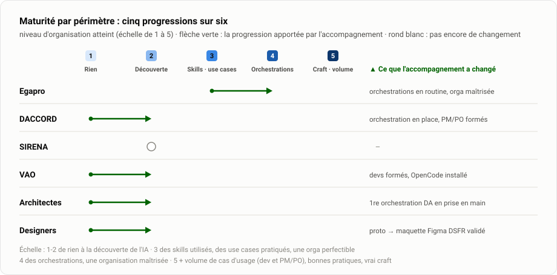

# Transformation IA · Ministères sociaux

**Édition du lundi 10 août 2026** · mise à jour hebdomadaire · [le détail, chantier par chantier](Details.md) · [la stratégie (PDF)](Livrables/Pr%C3%A9sentation-strat%C3%A9gie-transfo-ia/Point-etape_Adoption-IA.pdf) · [dashboard GitHub](https://github.com/orgs/SocialGouv/projects/198) · [Grist](https://grist.numerique.gouv.fr/o/tranfo-ia/rFkVL6aLFbrE/Etat-davancement)

## 🏆 Ce que l'accompagnement a changé, métier par métier

Le point de départ constaté à l'arrivée de la mission, et ce que chaque fonction sait faire aujourd'hui.

| Métier | Point de départ | Aujourd'hui |
|---|---|---|
| **Architectes** | Aucun intérêt exprimé pour l'IA | Intérêt suscité pour l'IA par notre atelier, **Cinq use cases identifiés** |
| **Développeurs · Egapro** | Des usages IA bons, mais avec un cadre perfectible | Orchestrations en routine, désormais **optimisées et sécurisées** : codeur et testeur séparés, le code n'est plus testé par l'agent qui l'a écrit |
| **Développeurs · DACCORD** | Usage et compréhension de l'IA peu matures | L'équipe **monte sa propre orchestration** (accompagnement individuel en cours) |
| **Chef de projet · Egapro** | Un suivi décalé de la vitesse réelle du dev augmenté, roadmap design invisible | **Pilotage adapté à l'IA** : lancement d'un chantier d'amélioration du pilotage |
| **Chefs de projet · DACCORD, SIRENA** | Tickets rédigés à la main, allers-retours entre métier et équipes | **Formation actée** à la génération de tickets Jira sur poste ministère (DACCORD le 25 août, créneau SIRENA à caler), valeur ajoutée validée par les chefs de projet |
| **Designers** | « L'IA a peu de valeur pour nous » | Depuis un poste ministère : **prototypes HTML au DSFR** testables par des utilisateurs, puis **maquette Figma générée** du prototype retenu, DSFR respecté |
| **Poste de travail** | Pas d'IA générative possible sur PC ministère | **Deux voies opérationnelles** : OpenCode Desktop (sans droits admin, clé Albert) · Claude Code dans VS Code (clé Bedrock) · [qui peut utiliser quoi](#qui-peut-utiliser-quoi) |

La dynamique s'étend : VAO entre dans la boucle avec l'atelier dev augmenté du 8 septembre.

## Avancement par chantier

<picture>
  <source media="(prefers-color-scheme: dark)" srcset="Etat-avancement/assets/02-maturite-org-dark.svg">
  
</picture>

**L'échelle** : 1-2 de rien à la découverte de l'IA · 3 des skills utilisés, des use cases pratiqués, une organisation perfectible · 4 des orchestrations, une organisation maîtrisée · 5 orchestrations, volume de cas d'usage (dev et PM/PO), bonnes pratiques renseignées, vrai craft.

| Chantier | Accompagnement | Où on en est | Prochaine étape |
|---|:---:|---|---|
| **Egapro** |  | Périmètre pilote : orchestrations en routine, designer autonome sur les prototypes, 3 use cases montés de niveau. Accessibilité : l'audit du code passe de 31 à 16 erreurs | Arbitrer avec Gary le portage de l'outil de pré-audit hors des sprints |
| **DACCORD** |  | Atelier skills du 6/08 : skills couvrant changement de version, changelog, dev front, dev back et plan d'implem ; tests back / front à ajouter. Orchestrations en cours | Accompagnement individuel : orchestration à mettre en place sur le frontend et le backend · Formation à la génération de tickets le 25/08 avec Richard et Noura |
| **SIRENA** |  | Diagnostic complété côté produit : Aurélie a repris le projet en juin et demande explicitement à être formée à l'usage de l'IA pour le PM / PO | Formation à la génération de tickets : créneau à caler |
| **VAO** |  | Équipe en découverte ; Halim identifié pour la génération de tickets intelligibles via MCP (point produit du 6/08) | Caler le créneau avec Halim · atelier dev augmenté le 8 septembre |
| **Transverse** |  | bench des harness livré · matrice des harness disponibles aux collaborateurs livré · Bedrock cadré avec AWS · référentiels d'architecture et de bonnes pratiques cadrés avec Igor (28/07) · 5 use cases IA identifiés avec les architectes (4/08) · population produit cadrée (6/08) | Priorisation des use cases par les architectes d'ici au 21 août · Produire une bibliothèque de skills basées sur les référentiels d'Igor · Explorer Scaleway et Google Vertex AI (observabilité indépendante du harness)|

 l'accompagnement a changé quelque chose ·  pas encore de changement. BIO2 (refonte côté santé, lancement début septembre) rejoindra le suivi actif au fil de l'eau.

→ [La maturité périmètre par périmètre](Details.md#maturité-par-périmètre) · [le diagnostic fin, use case par use case](Details.md#matrice-de-maturité) · [le focus de chaque chantier](Details.md#focus-par-chantier)

### Plan d'actions détaillé

Le réalisé et son impact, la suite en cours et planifiée

**Le réalisé, l'impact en face** : ◆◆◆ du concret livré (skills, orchestrations, solutions) · ◆◆ formation, acculturation · ◆ cadrage, étude, communication.

| ✅ Réalisé | Chantier | Impact | Ce que ça change |
|---|---|:---:|---|
| Orchestration « codeur / testeur » en routine | Egapro | ◆◆◆ | Le code arrive testé par une instance indépendante : la qualité ne repose plus sur la seule relecture humaine |
| Pilotage adapté à l'IA : estimations T-shirt, tickets design | Egapro | ◆◆◆ | Le suivi colle à la vitesse réelle du dev augmenté ; la roadmap design devient visible et challengeable |
| Designer outillé : skills UX, formation prototypes | Egapro | ◆◆◆ | Plusieurs prototypes HTML générés avant de maquetter : le designer se projette au lieu d'itérer à l'aveugle |
| Atelier de génération de DA avec les architectes (4/08) | Transverse | ◆◆◆ | Les architectes repartent acteurs : cinq use cases identifiés par eux-mêmes |
| Atelier d'amélioration des skills (6/08) | DACCORD | ◆◆◆ | Les skills couvrent cinq domaines et s'améliorent en commun, plus chacun dans son coin |
| Coaching développement augmenté (16/07) | DACCORD | ◆◆ | Dès le lundi suivant, les développeurs mettaient leurs system prompts en commun, de leur propre initiative |
| Point design avec Louis : transférer un prototype vers Figma en respectant parfaitement le DSFR (13/08) | Transverse | ◆◆ | Le prototype automatisé permet d'aller plus vite, la maquette Figma en composants DSFR officiels garantit la fiabilité ; Louis valide le use case, condition pour l'échelle : un compte Figma full |
| Benchmark des harness et modèles | Transverse | ◆ | Sept stacks comparées en perf / prix / souveraineté / conformité : la base de la décision de stack |
| Tableau des outillages collaborateurs | Transverse | ◆ | Exploration des possibilités offertes par les pc du ministères et comparatif avec les possibilités d'outillage des externes |
| Cadrage de la voie Bedrock avec AWS (23/07) | Transverse | ◆ | Possibilité d'outiller en licences Claude (paiement au token) avec de l'observabilité |
| Cadrage des référentiels d'architecture avec Igor (28/07) | Transverse | ◆ | Le référentiel outillé, en construction, part sur des bases partagées |
| Point d'adoption IA population produit (6/08) | Transverse | ◆ | Les use cases RU et PM / PO se formalisent ; VAO et BIO2 entrent dans le suivi |

Sur les périmètres actifs, l'impact est presque exclusivement du concret ; les actions modérées sont toutes transverses : les chantiers de fond qui conditionnent le passage à l'échelle.

**La suite** :

| Statut | Actions |
|---|---|
| 🔄 **En cours** | accompagnement individuel skills et orchestration DACCORD (Sébastien, Florian, Sylvain) · orchestrations Egapro → Jira (DACCORD) · pré-audit d'accessibilité Egapro · tickets de spec DACCORD · constitution du référentiel d'architecture outillé · solution de prototypes DSFR avec Louis (démo validée le 13/08) |
| 📅 **Planifié** | formation PM / PO : DACCORD le 25/08, SIRENA à caler · bench élargi Bedrock (août) · catalogue de skills partagés (courant août) · acculturation IA des architectes (fin août) · sélection des use cases DA (sem. du 31/08) · tickets BIO2 avec Yuna (début sept.) · rencontre du centre logiciel (introduction par Olivier) · atelier dev augmenté VAO (8/09) · cartographie des comptes Bedrock (fin sept.) |
| ⏭️ **À lancer** | explorations Scaleway et Google Vertex AI (une observabilité sans harness imposé) · tickets VAO avec Halim · acculturation IA des PO · acculturation de l'ensemble des designers · centralisation de la documentation fonctionnelle · évangélisation des équipes du CEPS |

S'y ajoutent les déclinaisons des actions éprouvées, à cadrer sur DACCORD, SIRENA et VAO.

→ [Le plan d'actions commenté, action par action](Details.md#plan-dactions) · [l'impact de chaque action, y compris à venir](Details.md#impact-des-actions)

## Roadmap

<picture>
  <source media="(prefers-color-scheme: dark)" srcset="Etat-avancement/assets/04-roadmap-dark.svg">
  
</picture>

## La cible : l'usine logicielle

Un des objectifs de l'accompagnement : une usine logicielle où chaque étape du cycle combine deux rails — un rail agentique qui génère, un rail déterministe qui vérifie. L'agent propose, la règle prouve, l'humain valide. Son pilotage s'adosse à DORA, chaque indicateur lu avant / après pour isoler l'apport de l'IA.

<picture>
  <source media="(prefers-color-scheme: dark)" srcset="Etat-avancement/assets/08-usine-dark.svg">
  
</picture>

<picture>
  <source media="(prefers-color-scheme: dark)" srcset="Etat-avancement/assets/09-tdb-dora-dark.svg">
  
</picture>

## Outillage

L'outillage se joue sur trois plans : ce que valent les stacks (performance, prix, souveraineté, conformité), qui prépare le choix de la stack interne ; ce que chaque population peut réellement installer, selon le poste et le statut ; et la voie d'accès aux modèles, qui conditionne l'observabilité et la liberté de choisir son harness. À ce stade, deux voies passent pour toutes les populations : OpenCode Desktop et VS Code avec le plugin Claude Code, adossés à Bedrock / Scaleway ou Albert.

### Ce que dit le bench

Le comparatif des sept stacks : performance, prix, souveraineté, conformité

<picture>
  <source media="(prefers-color-scheme: dark)" srcset="Etat-avancement/assets/06-bench-dark.svg">
  
</picture>

- **Souveraineté (au sens CNIL)** : seules deux voies tiennent — **Albert (DINUM)**, SecNumCloud et utilisable avec OpenCode ([guide officiel](https://guides.ia.numerique.gouv.fr/albert-api/guides/ide#agentic-coding-opencode)), et **Mistral** (éditeur français) avec son harness Vibe. **Bedrock n'est pas souverain** : CLOUD Act, quelle que soit la région.
- **Conformité RGPD** : Bedrock en région UE (DPA AWS) reste une voie valable pour les modèles Anthropic, dont **Fable 5** (95 % SWE-bench, le plus performant du bench) ; Mistral et Albert conformes ; Anthropic direct partiel (transfert hors UE) ; **OpenRouter sans garanties** — à réserver éventuellement aux externes.
- **Voie Bedrock précisée avec AWS (23/07)** ([compte rendu](CR/transverse/AWS-Bedrock-23-07-2026.txt)) : large catalogue de modèles (dont open-weight chinois) en conservant l'observabilité — de quoi envisager moins cher qu'Anthropic. En attente : liste des modèles et documentation d'observabilité.
- **Prochaines étapes** : bench élargi aux modèles Bedrock (août), puis bench en conditions réelles (Albert / DeepSeek V4 Flash via OpenCode face à Claude). [Le support complet (PDF)](Livrables/benchHarness/Bench_Coding-Agentique.pdf) compare les 7 stacks et recommande selon la priorité.

> [!WARNING]
> **Le coût ne se pose pas pareil pour les externes et les internes.** Les externes peuvent rester sur leur abonnement Claude (forfait, consommation incluse). Les internes démarreront à environ 20 € par siège, **plus chaque token consommé au prix du modèle** : leur coût suivra l'usage — d'où l'enjeu du bench pour les internes et la CI/CD.

### Qui peut utiliser quoi

La matrice harness × population : ce qu'il est possible d'installer

Le bench dit ce que vaut chaque stack ; cette matrice dit ce qu'il est possible d'installer, population par population : 🟢 possible · 🟠 possible mais non conforme · 🔴 impossible · ⏳ à instruire.

| Harness + fournisseur de modèles | Internes · Windows | Internes · Linux | Internes · Mac | Externes · non confidentiel | Externes · confidentiel |
|---|:---:|:---:|:---:|:---:|:---:|
| **OpenCode Desktop + Bedrock / Scaleway ou Albert** | 🟢 | ⏳ | 🟢 | 🟢 | 🟢 |
| **VS Code (plugin Claude Code) + Bedrock / Scaleway ou Albert** | 🟢 | ⏳ | 🟢 | 🟢 | 🟢 |
| OpenCode Desktop + modèles gratuits | 🟠 | ⏳ | 🟠 | 🟠 | 🟠 |
| VS Code (plugin Claude Code) + clé personnelle | 🟠 | ⏳ | 🟠 | 🟠 | 🟠 |
| Claude Desktop + Bedrock / Scaleway | 🔴 | ⏳ | 🟠 | 🟠 | 🟠 |
| Claude Desktop + clé personnelle | 🔴 | ⏳ | 🟠 | 🟠 | 🟠 |
| Codex + Bedrock / Scaleway | 🔴 | ⏳ | 🟠 | 🟠 | 🟠 |
| Codex + clé personnelle | 🔴 | ⏳ | 🟠 | 🟠 | 🟠 |

Tout le reste bute sur le poste interne (Claude Desktop et Codex, impossibles sur Windows) ou sur la conformité (clés personnelles, modèles gratuits).

Poste Linux interne : faisabilité à instruire. Matrice de travail : [Livrables/Outillage/matrice-outillage.md](Livrables/Outillage/matrice-outillage.md).

### Trois voies d'accès aux modèles

Bedrock exploré : viable, mais il impose Claude Code · Scaleway et Google Vertex AI à explorer

L'exploration avec AWS a validé une solution viable : Claude Code adossé à l'observabilité Bedrock (usage et coûts suivis). Mais cette voie verrouille le choix du harness, d'où deux pistes à instruire.

| Fournisseur | Ce qu'il apporte | Le point à lever | Où on en est |
|---|---|---|---|
| **AWS Bedrock** | Claude Code avec observabilité complète · région UE · large catalogue de modèles | L'observabilité est adossée à Claude Code : le harness est imposé | ✅ Exploré avec AWS ([CR du 23/07](CR/transverse/AWS-Bedrock-23-07-2026.txt)) : viable |
| **Scaleway** | Des modèles open-weight intéressants · souveraineté française | Valider le champ des possibles côté observabilité | 🔍 À explorer |
| **Google Vertex AI** | Un accès à des modèles frontier de plusieurs éditeurs (à confirmer) | Vérifier l'observabilité depuis n'importe quel harness | 🔍 À explorer |

**Pourquoi chercher au-delà de Bedrock** : imposer Claude Code n'est pas neutre. Ce harness est très gourmand en contexte : taillé pour les modèles frontier, il risque de moins bien fonctionner avec les modèles moins onéreux (open-weight chinois notamment). La cible : une observabilité indépendante du harness, pour choisir librement le couple harness × modèle selon la tâche et le budget.

## ⚖️ Décisions attendues

| Décision | Ce qui est en jeu | Qui tranche, quand |
|---|---|---|
| **Porteur du pré-audit d'accessibilité** : hors des sprints, sans reposer sur Egapro, avec la mesure intégrée | Sans porteur ni mesure, l'outil restera piloté au feeling | **Gary** · arbitrage attendu |
| **Accès au centre logiciel** pour y packager les harness cibles | Deux voies passent déjà pour les internes ([la matrice](#qui-peut-utiliser-quoi)) : l'enjeu est la **liberté du choix du harness** | **Les personnes du centre logiciel** · introduction par Olivier à venir |
| **Stack des agents internes, et des externes sur sujets confidentiels** | Trouver la formule optimale en rapport qualité / prix, au plus près des exigences de souveraineté et de légalité | À instruire après le [bench élargi aux modèles Bedrock](#ce-que-dit-le-bench) (août) et les [explorations Scaleway / Vertex AI](#trois-voies-daccès-aux-modèles) |

## Repères

- [Details.md](Details.md) : plan d'actions commenté, maturité par périmètre, impact action par action, matrice complète, focus par chantier
- [Stratégie de transformation IA (PDF)](Livrables/Pr%C3%A9sentation-strat%C3%A9gie-transfo-ia/Point-etape_Adoption-IA.pdf) : enjeux, exploration, plan d'action en trois horizons
- [Réalisations par métier](Livrables/Realisations_par_metier/) : skills, kits de configuration, tutoriels, générateurs de DA
- Pilotage : [dashboard GitHub](https://github.com/orgs/SocialGouv/projects/198) · [état d'avancement Grist](https://grist.numerique.gouv.fr/o/tranfo-ia/rFkVL6aLFbrE/Etat-davancement)

---

Mission Ippon Technologies · Selim Boukhari (sboukhari@ippon.fr) · graphiques régénérés chaque semaine via <code>Etat-avancement/build/generate_charts.py</code>
