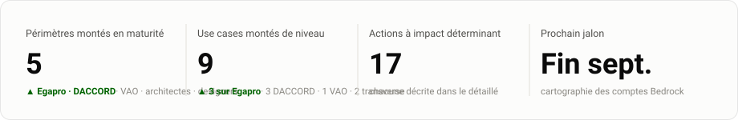
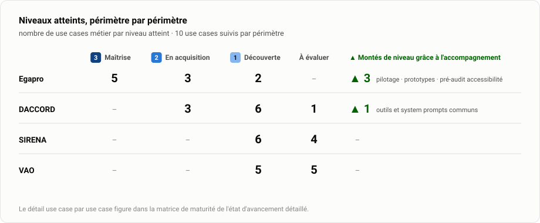
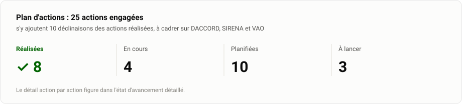

# Transformation IA · Ministères sociaux

**Accompagner l'adoption de l'IA par les équipes du numérique** (Secrétariat général · Direction du numérique), sur trois enjeux (identifier les usages, accompagner la maîtrise, évangéliser) et quatre métiers (architectes, chefs de projet, designers, développeurs).

**Édition du mercredi 23 juillet 2026** · mise à jour hebdomadaire · [version détaillée](Etat-avancement/Etat-avancement-detaille.md) · [la stratégie (PDF)](Livrables/Pr%C3%A9sentation-strat%C3%A9gie-transfo-ia/Point-etape_Adoption-IA.pdf)

---

## 🔦 Temps fort du mois

> [!IMPORTANT]
> **Développement augmenté : l'équipe DACCORD passe à l'acte.** Formés le 16 juillet (prompt engineering, system prompts, orchestration de subagents, workflow complet du développement augmenté), les développeurs ont engagé **dès le lundi suivant, de leur propre initiative, la mise en commun de leurs system prompts** (agents, rules, skills) : la première brique d'une pratique d'équipe structurée.
>
> **Les retours de la formation annonçaient ce déclic** ([compte rendu](CR/Feedback_Coaching_Devs_DACCORD.docx)) : « claire », « des exemples concrets qui ont aidé à comprendre les concepts », « a rendu abordable des sujets qui auraient pu être compliqués »… et surtout « le sentiment que c'est atteignable », de quoi « se projeter sur les compétences à acquérir ».
>
> **Le chemin parcouru est net : d'une IA regardée de loin à une volonté d'implémentation structurée et sérieuse.** La suite : relecture des premiers skills par Selim, puis atelier de co-construction pour fiabiliser les system prompts. Il faudra prévoir ensuite des accompagnements ponctuels afin d'ancrer le développement augmenté dans l'équipe et avec les meilleures pratiques.

## L'essentiel

<picture>
  <source media="(prefers-color-scheme: dark)" srcset="Etat-avancement/assets/01-kpi-dark.svg">
  
</picture>

La stratégie en trois horizons est posée et validée ; son premier horizon (« outiller chaque métier ») est en exécution : **chaque métier dispose déjà d'au moins un use case outillé et éprouvé sur le terrain**.

## Avancement par chantier

<picture>
  <source media="(prefers-color-scheme: dark)" srcset="Etat-avancement/assets/02-maturite-dark.svg">
  
</picture>

| Chantier | Statut | Où on en est | Prochaine étape |
|---|:---:|---|---|
| **Egapro** | 🟢 ↗ | Périmètre pilote : orchestrations maîtrisées, designers autonomes sur les prototypes, 3 use cases montés de niveau | Industrialiser le pré-audit d'accessibilité |
| **DACCORD** | 🟢 ↗ | Équipe passée à l'acte : mise en commun des system prompts engagée en autonomie dès le 20/07, orchestrations Egapro en cours d'adaptation à Jira | Relecture des skills, puis atelier de co-construction |
| **SIRENA** | 🟡 → | Diagnostic posé : usage IA réel mais individuel, sans coordination d'équipe | Cadrer l'accompagnement (démo, atelier skills) |
| **VAO** | 🟡 → | Équipe en découverte, besoins identifiés | Atelier dev augmenté en septembre |
| **Transverse** | 🟢 ↗ | Stratégie 3 horizons validée, bench des harness livré | Ateliers DA architectes et Claude Enterprise le 3 août |

🟢 sur la trajectoire · 🟡 cadrage en cours · 🔴 point d'attention. SRDT et DomiFA, rencontrées en exploration, rejoindront le suivi actif au fil de l'eau.

## Plan d'actions

<picture>
  <source media="(prefers-color-scheme: dark)" srcset="Etat-avancement/assets/03-actions-dark.svg">
  
</picture>

**✅ Réalisé** : coaching développement augmenté DACCORD (16/07) · orchestration « codeur / testeur » en routine sur Egapro · pilotage adapté à l'IA sur Egapro (estimations T-shirt, tickets design) · designers Egapro outillés (skills UX, formation prototypes)

**🔄 En cours** : portage des orchestrations Egapro vers Jira (DACCORD) · synchronisation du pré-audit d'accessibilité (Egapro) · accompagnement tickets de spec (DACCORD)

**⏭️ À lancer** : acculturation IA des PO · stratégie d'embarquement des designers · comptage des sièges internes à outiller · bench élargi des harness

→ [Le plan d'actions commenté, action par action](Etat-avancement/Etat-avancement-detaille.md#plan-dactions)

## Cap des prochaines semaines

<picture>
  <source media="(prefers-color-scheme: dark)" srcset="Etat-avancement/assets/04-roadmap-dark.svg">
  
</picture>

## Design : le prototype avant la maquette

**La démarche design avance sur deux fronts** ([compte rendu](CR/Avancement-Design.txt)). Sur Egapro, Raphael a changé sa façon de travailler : grâce aux skills fournis, il **génère plusieurs versions d'un prototype HTML avant de maquetter**, et se projette ainsi sur ce qu'il veut maquetter au lieu d'itérer à l'aveugle. Prochaine marche, avec Louis : **industrialiser un framework de skills générant des prototypes conformes au DSFR** (focus anti-hallucination sur le design system), Louis apportant les règles d'UX, Selim la performance des skills. Une fois la solution éprouvée, une **session d'acculturation ouvrira la démarche à l'ensemble des designers**.

## Visibiliser l'accompagnement

**La stratégie comprend un volet de visibilisation : faire connaître le savoir-faire IA du studio Tech de la DNUM au-delà des équipes suivies** (troisième enjeu de la mission : évangéliser), en répondant aux besoins concrets d'autres entités. Dans ce cadre, appui au **CEPS** (Comité économique des produits de santé) : sa veille du Journal officiel sur les spécialités pharmaceutiques est désormais **automatisée et restituée en newsletter** ([le livrable](Livrables/NewsLetterGen/) · [compte rendu](CR/R%C3%A9alisations-secondaires.txt)). À noter : le besoin était exprimé « avec de l'IA », et la solution atteint l'objectif sans en avoir besoin. L'IA là où elle apporte, pas par réflexe. Reste à éprouver les cas limites avant remise au CEPS, qui a validé l'intérêt.

## Outillage : ce que dit le bench

<picture>
  <source media="(prefers-color-scheme: dark)" srcset="Etat-avancement/assets/06-bench-dark.svg">
  
</picture>

> [!WARNING]
> **Le coût ne se pose pas pareil pour les externes et les internes.** Les prestataires externes peuvent rester sur leur abonnement Claude (forfait mensuel, consommation incluse). Les agents internes démarreront à environ 20 € par siège, **auxquels s'ajoute chaque token consommé au prix du modèle** : leur coût suivra l'usage. C'est tout l'enjeu du bench : identifier pour les internes et la CI/CD la stack au meilleur rapport performance / prix / souveraineté / conformité.

**Souveraineté et conformité sont deux questions distinctes, et elles départagent.** Sur la **souveraineté au sens de la CNIL**, seules deux voies tiennent : **Albert (DINUM)**, pleinement souveraine (SecNumCloud, État français) et utilisable avec OpenCode ([guide officiel de la DINUM](https://guides.ia.numerique.gouv.fr/albert-api/guides/ide#agentic-coding-opencode)), et **Mistral** (éditeur français, SecNumCloud en option via Outscale) avec son harness **Vibe**. **Bedrock n'est pas souverain** : AWS reste soumis au CLOUD Act quelle que soit la région d'hébergement. Sur la **conformité RGPD** en revanche, Bedrock en région UE (DPA AWS) reste une voie valable pour les modèles Anthropic, dont **Fable 5** (95 % SWE-bench, le plus performant du bench) ; Mistral et Albert sont également conformes. **Opus via Anthropic** implique un transfert hors UE ; **GLM, DeepSeek ou Kimi K3 via OpenRouter** n'offrent aucune garantie : à réserver éventuellement aux externes.

Le [support complet du bench (PDF)](Livrables/benchHarness/Bench_Coding-Agentique.pdf) compare les 7 stacks sur prix, performance, souveraineté, conformité et faisabilité, et recommande selon la priorité. Prochaine étape : le bench en conditions réelles (scénario Albert / DeepSeek V4 Flash via OpenCode face à Claude avec et sans abonnement).

## Repères

- [État d'avancement détaillé](Etat-avancement/Etat-avancement-detaille.md) : matrice de maturité complète, plan d'actions commenté
- [Stratégie de transformation IA (PDF)](Livrables/Pr%C3%A9sentation-strat%C3%A9gie-transfo-ia/Point-etape_Adoption-IA.pdf) : enjeux, exploration, plan d'action en trois horizons
- [Réalisations par métier](Livrables/Realisations_par_metier/) : skills, kits de configuration, tutoriels, générateurs de DA
- Pilotage : [dashboard GitHub](https://github.com/orgs/SocialGouv/projects/198) · [état d'avancement Grist](https://grist.numerique.gouv.fr/o/tranfo-ia/rFkVL6aLFbrE/Etat-davancement)

---

Mission Ippon Technologies · Selim Boukhari (sboukhari@ippon.fr) · graphiques régénérés chaque semaine via <code>Etat-avancement/build/generate_charts.py</code>
