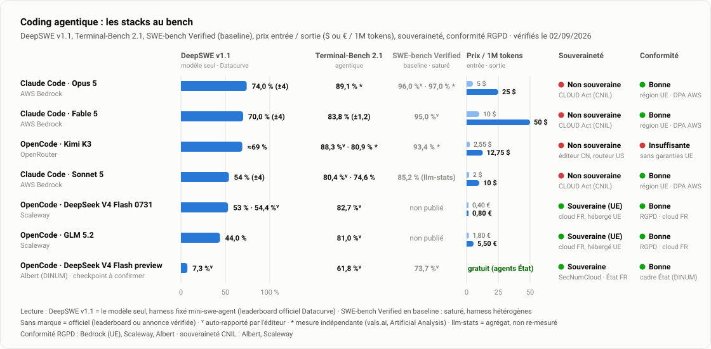

# Transformation IA · Ministères sociaux

**Accompagner l'adoption de l'IA par les équipes du numérique** (Secrétariat général · Direction du numérique), sur trois enjeux (identifier les usages, accompagner la maîtrise, évangéliser) et quatre métiers (architectes, chefs de projet, designers, développeurs).

**Édition du vendredi 17 juillet 2026** · mise à jour hebdomadaire · [version détaillée](Etat-avancement/Etat-avancement-detaille.md) · [la stratégie (PDF)](Livrables/Pr%C3%A9sentation-strat%C3%A9gie-transfo-ia/Point-etape_Adoption-IA.pdf)

---

## 🔦 Temps fort de la semaine

> [!IMPORTANT]
> **L'équipe DACCORD coachée au développement augmenté.** Session menée jeudi 16 juillet avec les développeurs : prompt engineering, fenêtre de contexte, system prompts (agents, rules, skills), orchestration de subagents et le workflow complet du développement augmenté :
>
> `Plan` → `Challenge du plan` → `Checklist autoportante` → `Implémentation` → `Vérification` → `Build / tests`
>
> **Les retours de l'équipe** ([compte rendu](CR/Feedback_Coaching_Devs_DACCORD.docx)) : une formation qui « a rendu abordable des sujets qui auraient pu être compliqués », « claire », interactive, avec « des exemples concrets qui ont aidé à comprendre les concepts ». Et surtout : « partir du niveau de l'équipe et parvenir quand même à la fin à comprendre les orchestrations, tout en ayant le sentiment que c'est atteignable » ; « la formation permet de se projeter sur les compétences à acquérir ».
>
> L'équipe se projette vers un très haut niveau de maîtrise et veut s'y attaquer dès maintenant : un **atelier de co-construction de skills, agents et rules** se prépare pour les prochaines semaines avec DACCORD, afin d'ancrer ces pratiques dans son quotidien.

## L'essentiel

<picture>
  <source media="(prefers-color-scheme: dark)" srcset="Etat-avancement/assets/01-kpi-dark.svg">
  
</picture>

La stratégie en trois horizons est posée et validée ; son premier horizon (« outiller chaque métier ») est en exécution : **chaque métier dispose déjà d'au moins un use case outillé et éprouvé sur le terrain**.

## Avancement par chantier

<picture>
  <source media="(prefers-color-scheme: dark)" srcset="Etat-avancement/assets/02-maturite-dark.svg">
  
</picture>

| Chantier | Statut | Où on en est | Prochaine étape |
|---|:---:|---|---|
| **Egapro** | 🟢 ↗ | Périmètre pilote : orchestrations maîtrisées, designers autonomes sur les prototypes, 3 use cases montés de niveau | Industrialiser le pré-audit d'accessibilité |
| **DACCORD** | 🟢 ↗ | Équipe embarquée : coaching dev augmenté réalisé le 16/07, orchestrations Egapro en cours d'adaptation à Jira | Atelier de co-construction skills, agents, rules |
| **SIRENA** | 🟡 → | Diagnostic posé : usage IA réel mais individuel, sans coordination d'équipe | Cadrer l'accompagnement (démo, atelier skills) |
| **VAO** | 🟡 → | Équipe en découverte, besoins identifiés | Atelier dev augmenté en septembre |
| **Transverse** | 🟢 ↗ | Stratégie 3 horizons validée, bench des harness livré | Ateliers DA architectes et Claude Enterprise le 3 août |

🟢 sur la trajectoire · 🟡 cadrage en cours · 🔴 point d'attention. SRDT et DomiFA, rencontrées en exploration, rejoindront le suivi actif au fil de l'eau.

## Plan d'actions

<picture>
  <source media="(prefers-color-scheme: dark)" srcset="Etat-avancement/assets/03-actions-dark.svg">
  
</picture>

**✅ Réalisé** : coaching développement augmenté DACCORD (16/07) · orchestration « codeur / testeur » en routine sur Egapro · pilotage adapté à l'IA sur Egapro (estimations T-shirt, tickets design) · designers Egapro outillés (skills UX, formation prototypes)

**🔄 En cours** : portage des orchestrations Egapro vers Jira (DACCORD) · synchronisation du pré-audit d'accessibilité (Egapro) · accompagnement tickets de spec (DACCORD)

**⏭️ À lancer** : acculturation IA des PO · stratégie d'embarquement des designers · comptage des sièges internes à outiller · bench élargi des harness

→ [Le plan d'actions commenté, action par action](Etat-avancement/Etat-avancement-detaille.md#plan-dactions)

## Cap des prochaines semaines

<picture>
  <source media="(prefers-color-scheme: dark)" srcset="Etat-avancement/assets/04-roadmap-dark.svg">
  
</picture>

## Outillage : ce que dit le bench

<picture>
  <source media="(prefers-color-scheme: dark)" srcset="Etat-avancement/assets/06-bench-dark.svg">
  
</picture>

> [!WARNING]
> **Le coût ne se pose pas pareil pour les externes et les internes.** Les prestataires externes peuvent rester sur leur abonnement Claude (forfait mensuel, consommation incluse). Les agents internes démarreront à environ 20 € par siège, **auxquels s'ajoute chaque token consommé au prix du modèle** : leur coût suivra l'usage. C'est tout l'enjeu du bench : identifier pour les internes et la CI/CD la stack au meilleur rapport performance / prix / souveraineté.

**Et la souveraineté départage.** La voie **Albert (DINUM)** est la seule pleinement souveraine (SecNumCloud, État français) et fonctionne avec OpenCode : montage documenté par [le guide officiel de la DINUM](https://guides.ia.numerique.gouv.fr/albert-api/guides/ide#agentic-coding-opencode). **Opus 4.8 via Bedrock**, la voie pressentie pour les internes, n'est que partiellement souveraine (sensible au CLOUD Act). **Opus via Anthropic, GLM ou DeepSeek via OpenRouter** ne le sont pas du tout : à réserver éventuellement aux externes.

Le [support complet du bench (PDF)](Livrables/benchHarness/Bench_Coding-Agentique.pdf) compare les stacks sur prix, performance, souveraineté et faisabilité, et recommande selon la priorité. Prochaine étape : le bench en conditions réelles (scénario Albert / DeepSeek V4 Flash via OpenCode face à Claude avec et sans abonnement).

## Repères

- [État d'avancement détaillé](Etat-avancement/Etat-avancement-detaille.md) : matrice de maturité complète, plan d'actions commenté
- [Stratégie de transformation IA (PDF)](Livrables/Pr%C3%A9sentation-strat%C3%A9gie-transfo-ia/Point-etape_Adoption-IA.pdf) : enjeux, exploration, plan d'action en trois horizons
- [Réalisations par métier](Livrables/Realisations_par_metier/) : skills, kits de configuration, tutoriels, générateurs de DA
- Pilotage : [dashboard GitHub](https://github.com/orgs/SocialGouv/projects/198) · [état d'avancement Grist](https://grist.numerique.gouv.fr/o/tranfo-ia/rFkVL6aLFbrE/Etat-davancement)

---

Mission Ippon Technologies · Selim Boukhari (sboukhari@ippon.fr) · graphiques régénérés chaque semaine via <code>Etat-avancement/build/generate_charts.py</code>
